# Curso de Angular

## C O N T E N I D O

El siguiente documento presenta una descripción detallada de los conocimientos adquiridos y prácticas realizadas durante el curso de Angular de la plataforma Udemy. [Mas información Aquí: https://www.udemy.com/course/angular-fernando-herrera](https://www.udemy.com/course/angular-fernando-herrera)

## Instalación

Se requiere:

Google Chrome
Visual Studio Code
Postman o extensión REST CLIENT de Code.
Mongo Compass
Git
Tener una cuenta en github o bitbucket, etc.

Para Mongo Compass ir al sitio https://www.mongodb.com/try/download/compass descargar y luego instalar el rpm ( o el ejecutable dependiendo de su sistema operativo)

Extensiones recomendadas para VSCode

    Angular Snippets
    Angular Language Service
    Angular Inline
    Auto Close Tag
    TypeScript importer
    Rest Client

Installing Angular CLI

NOTA: Ver comentarios al final de esta sección para instalar la versión LTS compatible con Angular Cli.

Como usuario normal, Instalar o actualiza a la última versión de Node

```
$ nvm install node
```


Si la versión instalada es > 18.0.0 debe instalar la 16.10.x

```
$ nvm install 16.10.0
$ nvm use 16.10.0
$ nvm alias default 16.10.0  (Esto hará que los editores como code usen la versión or default)
```

Instalar angular-CLI

```
$ npm install -g @angular/cli
```

Probar Versión:

```
$ ng --version

Angular CLI: 13.3.4
Node: 16.10.0
Package Manager: npm 7.24.0
OS: linux x64
```


NOTA: Luego de retomar el curso debí instalar la última versión estable soportada por Angular con este comando:

```
 nvm install --lts
 vm alias default 20.9.0
 npm uninstall -g @angular/cli
 npm install -g @angular/cli
```

## Introducción a Angular

Angular es un framework, mantenido por google, viene con todo lo que se necesite para trabajar las aplicaciones. Las aplicaciones Angular son Modulares, es decir, todo el código se escribe en módulos independientes.

Existe 5 bloques fundamentales

- Componentes
- Rutas
- Directivas
- Servicios
- Módulos

**Los componentes:**

- Es un bloque de codigo con segmento de HTML más una clase de Typescript. El objetivo es que cada componente sean bloques simples de código.

**Servicio**

- Son Singleton que permiten trabajar la aplicacion con información centralizada. Los componentes hacen uso de los serivcios, Los servicios exponen funcionalidades a otros servicios o componentes.

**Directivas:**

- Existen 3 tipos de Directivas de Componentes, de estructuras y de atributos.

Directivas de Atributo

Alteran la apariencia o comportamiento de un elemento del DOM y son usados como atributos de los elementos. (ngModel, ngClass, ngStyle)

Directivas Estructurales

Alteran la estructura del DOM, agregando, eliminando y manipulando los elementos a los que están unidos. (*ngIf, *ngFor, ngSwitch, ngPlural )

Directivas de Componente

Las Directivas de Componente son directivas con un Template. Los componentes tienen decoradores “@Component”, el componente es un decorador @Directive que es extendido con características propias de los templates.

**Rutas:**

Inidican que componentes renderizar dependiendo el URL ingresado por el usuario. Una Ruta típica de Angular tiene dos propiedades: path : una cadena que coincide con la URL en la barra de direcciones del navegador. component : el componente que el enrutador debe crear al navegar a esta ruta.

**Módulos:**
Permiten agrupar componentes, incluso otros módulos. SE pueden descargar módulos existentes para usarlo dentro de la APP. Por ejemplo un módulo de Calendario.

## Instalar el CLI

Usaremos el Angular CLI (Command Line) de la siguiene manera

```
$ npm install -g @angular/cli
```

## Crear Nuevo proyecto

para crear un nuevo proyecto con el CLI usamos el siguiente comando:

```
$ ng new 01-bases --standalone false
```

`--standalone false` Las últimas versiones de Angular (2023) ya no usan por dafault NGModule, pero durante el curso se usa la version con NGModule, por lo tanto, esta parametro en false permite crear los proyectos tal como se hacia en las versiones anteriores, es decir de forma tradicional.

Esto genera el proyecto de pruebas y puede ejecutrase con el siguiente comando

```
$ ng serve -o
```

NOTA: si el comando anterior genera algún error, realizar nuevamente el `npm install`

### Archivos creados por el ng cli.

El proyecto cuenta con varios directorios y archivos

## Archivos

`.editconfig` archivo de configuración agregado por el plugin que permite agregar configuraciones para el editor.

`.gitignore`

`angular.json` Es un archivo importante, muy pocas configuraciones se hacen aca, en este archivo le decimos a angular ciertas configuraciones para nuestras app.

`karma.conf.js` Karma - a test runner

`tsconfig` un grupo de archivos para configuraciones de typescript. 

### Directorios

`.angular` archivo oculto que pocas veces se modifican, Ayuda a angular para detectar cambios, maneja el cache del proyecto, etc. 


`.vscode` Archivo del editor

`dist`  Directorio de distribución

`node_modules` Modulos de Node, dependencias.

`src` Código fuente

`src/app` Código fuente de nuestro proyecto

`src/assets` Los Assets 

`src/environments` Archivos de configuración

`src/main.ts` punto de entrada de nuestra App.


## Primera aproximación de un componente

```typescript
import { Component } from '@angular/core';

@Component({
  selector: 'app-root',
  templateUrl: './app.component.html',
  styleUrls: ['./app.component.css'],
})
export class AppComponent {
  title = 'Contador App';
}
```

**selector**: indica el elemento html que contendrá el componente una vez renderizado, en este caso es app-root ya que es la aplicación principal.

**templateUrl** permite incluir un template existente escrito en HTML.

Podemos pasar variables al template al momento de crear la clase del componente, como en el siguiente caso:

```typescript
export class AppComponent {
  title = 'Contador App';
}
```

Title puede luego usarse en el template de la siguiente forma:

```html
<h1>Hola Mundo</h1>
<span>Titulo desde componente: {{title}}</span>
```

Esto generará:

```
Hola Mundo
Titulo desde componente: Contador App
```

## Métodos en los componentes

Podemos agregar métodos en nuestra clase y usarlos desde el template de la siguiente forma:

```typescript
export class AppComponent {
  title: string = 'Contador App';
  numero: number = 10;

  acumular(valor: number) {
    this.numero += valor;
  }
}
```

Y consumirlo de la siguiente forma en el template:

```html
<button (click)=" acumular(+1) ">+1</button>
<button (click)=" acumular(-1) ">-1</button>
```

## Creando nuevos componentes.

Cuando la aplicación comienza a crecer, es necesario crear una estructura de directorios para organizar nuestro código. Cada componente con todos sus elementos se crea en sus propios directorios

Supongamos que vamos a crear un componente llamado `Heroe` pero este componente tiene una vista para renderizar información de un Heroe específico y tambien otro componente para mostrar información de los heroes en forma de lista, en este caso podriamos crear la siguiente estructura

```
└── heroes
│       ├── heroe
│       │   ├── heroe.component.html
│       │   └── heroe.component.ts
│       └── listado
```

El directorio Heroe contiene el componente que muestra información de un heroe específico, mientras que el directorio listado, va a contener el componente para mostrar un listado de heroes.

De esta forma si necesitamos crear otro componente relacionado con heroes, creariamos un nuevo directorio dentro de heroes.

Veamos el componente Heroe.component.ts.

```typescript
import { Component } from '@angular/core';

@Component({
  selector: 'app-heroe',
  templateUrl: 'heroe.component.html',
})
export class HeroeComponent {
  nombre: string = 'IronMan';
  edad: number = 35;

  get nombreCapitalizado() {
    return this.nombre.toUpperCase();
  }

  obtenerNombre(): string {
    return `${this.nombre} - ${this.edad}`;
  }

  cambiarNombre(): void {
    this.nombre = 'Spiderman';
  }

  cambiarEdad(): void {
    this.edad = 43;
  }
}
```

Y su template:

```html
<h1>Heroe Component</h1>
<dl>
  <td>Nombre:</td>
  <dd>{{nombre}}</dd>

  <td>Edad:</td>
  <dd>{{edad}}</dd>

  <td>Función:</td>
  <dd>{{obtenerNombre()}}</dd>

  <td>Caiptalizado:</td>
  <dd>{{nombreCapitalizado}}</dd>
</dl>

<button (click)="cambiarNombre()">Cambiar Heroe</button>
<button (click)="cambiarEdad()">Cambiar Edad</button>
```

Notar como se usan las propiedades **nombre** y **edad** asi como una propiedad especial **get** llamada **nombreCapitalizado** y un método **obtenerNombre** Observe como se consumen esos elementos en el template.

Los métodos cambiarNombre() y cambiarEdad() cambian las propiedades nombre y edad del componente respectivamente. Al cambiar una propiedad, el componente volverá a renderizar todas aquellas partes (elementos del DOM) que dependen de la propiedad modificada.

## Crear Componente de forma automática.

Para crear un componente con el ngCLI, usaremos el generador de componentes:

```
$ ng generate component heroes/listado
```

Podemos usar la forma simplificada, por ejemplo

```
$ ng g c heroes/listado
```

g: Generate
c: Component

El último valor se refiere al path y nombre del componente. Si soloamente se especifica un valor, el componente será creado en el directorio app/src.

Las salida del comando anterior debe ser:

```
[fcruz@dev05 01-bases]$ ng generate component heroes/listdado
CREATE src/app/heroes/listdado/listdado.component.css (0 bytes)
CREATE src/app/heroes/listdado/listdado.component.html (23 bytes)
CREATE src/app/heroes/listdado/listdado.component.spec.ts (640 bytes)
CREATE src/app/heroes/listdado/listdado.component.ts (283 bytes)
UPDATE src/app/app.module.ts (586 bytes)
```

El componente creado se verá de la siguiente forma:

```typescript
import { Component, OnInit } from '@angular/core';

@Component({
  selector: 'app-listdado',
  templateUrl: './listdado.component.html',
})
export class ListdadoComponent implements OnInit {
  constructor() {}

  ngOnInit(): void {}
}
```

**ngOnInit** es parte del ciclo de vida de los componentes de angular, es un método que se dispara cuando el componente se ha inicializado, veremos estos ciclos de vida más adelante.

Por el momento podemos borra la referencia al OnInit, el archivo CSS y el archivo de pruebas.

## Directiva \*ngFor

Podemos recorrer arreglos o elementos iterables y a la vez imprimir su contenido en el html, veamos este ejemplo:

Actualicemos nuestro componente:

```typescript
import { Component } from '@angular/core';

@Component({
  selector: 'app-listado',
  templateUrl: './listado.component.html',
})
export class ListadoComponent {
  heroeBorrado: string = '';

  heroes: string[] = ['Spiderman', 'Superman', 'Hulk', 'Ironman'];

  borrarElemento() {
    this.heroeBorrado = this.heroes.shift() || '';
  }
}
```

Y nuestro Template:

```html
<p>Listado de Heroes</p>

<button (click)="borrarElemento()">Borrar Ùltimo</button>

<h2>Héroe Borrado: {{heroeBorrado}}</h2>

<ul>
  <li *ngFor="let heroe of heroes; let i = index">{{ i + 1}} - {{heroe}}</li>
</ul>
```

Recorremos el arreglo Heroes y luego imprimimos el contenido en un _\<ul\>_

## Directivas \*ngIf y else

Actualicemos nuestra plantilla con el siguiente código:

```html
<p>Listado de Heroes</p>

<button *ngIf="this.heroes.length" (click)="borrarElemento()">
  Borrar Ùltimo
</button>
<button *ngIf="this.heroes.length == 0" (click)="reiniciarLista()">
  Reiniciar
</button>

<h2 *ngIf="heroeBorrado.length; else noBorrado">
  Héroe Borrado: {{heroeBorrado}}
</h2>

<ng-template #noBorrado>
  <h2>No Borrado</h2>
</ng-template>

<ul>
  <li *ngFor="let heroe of heroes; let i = index">{{ i + 1}} - {{heroe}}</li>
</ul>
```

la derctiva \*ng-if="expresion" permite mostrar un elemento dependiendo del valor retornado al evaluar la expresión.

En el caso de los botones, se mostrará uno u otro en dependencia de la expresion "this.heroes.length y "this.heroes.length == 0 respectivamente.

Tambien podemos incorporar un Else con una referencia local (hacia una plantilla local) tal como se hace con el mensage de borrado:

```typescript
<h2 *ngIf="heroeBorrado.length; else noBorrado" >Héroe Borrado: {{heroeBorrado}}</h2>

<ng-template #noBorrado>
  <h2>No Borrado</h2>
</ng-template>
```

Si heroeBorrado.length es true ejecutará el bloque inicial H2, caso contrario renderizará la plantilla con nombre noBorrado la cual imprimer un H2 con texto No Borrado.

## Modulos

Implementaremos esta pantalla que consta de varios componentes, un listado y un formulario para agregar nueos elementos al listado.

<br/>
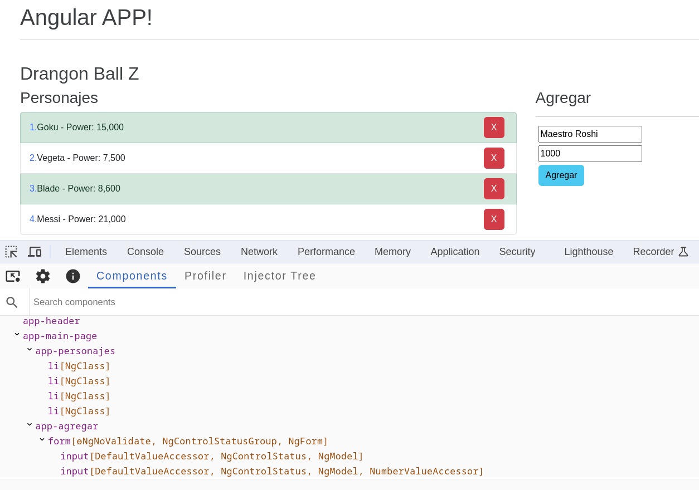

El objetivo de los módulos es ayudarnos a agrupar piezas de código que tienen relación entre sí. Permite tener un código mejor organizado, por ejemplo, actualmente tenemos los componentes:

- contador
- Heroes
  - Heroe
  - Listado

Todos estos componentes son manajedos en el módulo principal de la APP:

```typescript
@NgModule({
  declarations: [
    AppComponent,
    ContadorComponent,
    HeroeComponent,
    ListadoComponent
  ],
  imports: [
    BrowserModule
  ],
  providers: [],
  bootstrap: [AppComponent]
})
```

Notar como los componentes ContadorComponent, HeroeComponent, ListadoComponent son agregados al arreglo de las declarations, que pasa si nuestra app tiene 100 componentes? no podemos manejar 100 Componentes desde el APP Module, de modo que aca es donde entra la importancia de organizar el código en módulos.

Vamos a crear un nuevo Módulo para los componentes de Heroes:

```typescript
import { CommonModule } from '@angular/common';
import { NgModule } from '@angular/core';
import { HeroeComponent } from './heroe/heroe.component';
import { ListadoComponent } from './listado/listdado.component';

@NgModule({
  declarations: [HeroeComponent, ListadoComponent],
  exports: [HeroeComponent, ListadoComponent],
  imports: [CommonModule],
})
export class HeroesModule {}
```

Este archivo se crea en la raíz del directorio Heroes, con el nombre: **heroes.module.ts**

```
└── heroes
    ├── heroes.module.ts
    ├── heroe
    │   ├── heroe.component.html
    │   └── heroe.component.ts
    └── listado
        ├── listado.component.html
        └── listdado.component.ts
```

La sección **declarations** indica que componentes y declarativas pertenencen al módulo.

La sección de **exports** indica que componentes serán públicos y podrán ser usado por otros módulos que importen el módulo actual.

Mientras tanto la sección **import** indica que otros módulos serán usados por el módulo actual.

NOTA: el **CommonModule** se importa en aquellos componentes que utilizan directivas como *ngFor, *ngIf (entre otras) o pipes como currency pipe, Date pipe etc.

## Crear Módulos con el Generador del CLI

Ejecute el comando:

```
[fcruz@dev05 01-bases]$ ng generate module dbz
CREATE src/app/dbz/dbz.module.ts (189 bytes)
```

El modo autogenerado es:

```typescript
import { NgModule } from '@angular/core';
import { CommonModule } from '@angular/common';

@NgModule({
  declarations: [],
  imports: [CommonModule],
})
export class DbzModule {}
```

A continuación  agregamos un compomente al módulo recién creado:

```
[fcruz@dev05 01-bases]$ ng generate component dbz/mainPage
CREATE src/app/dbz/main-page/main-page.component.css (0 bytes)
CREATE src/app/dbz/main-page/main-page.component.html (24 bytes)
CREATE src/app/dbz/main-page/main-page.component.spec.ts (641 bytes)
CREATE src/app/dbz/main-page/main-page.component.ts (286 bytes)
UPDATE src/app/dbz/dbz.module.ts (283 bytes)
```

Ahora en la sección de declarations de nuestro módulo tenemos el nuevo componente.

```typescript
declarations: [MainPageComponent];
```

Angula CLI no ingresa el nuevo componente en la lista de Exports del Módulo, ya que puede ser un componente privado.

## Form Module

El siguiente bloque HTML genera un formulario el cual al hacer click en el botón Agregar refresca toda la página. en SPA esto no es un comportammiento aceptado.

```html
<form>
  <input type="text" placeholder="Nombre" />
  <input type="number" placeholder="Poder" />
  <button type="submit">Agregar</button>
</form>
```

Para evitar el evento de recargar la página durante el submit del Form podemos "prevenir" ese default event:

```html
<form (submit)="agregar($event)">
  <input type="text" placeholder="Nombre" />
  <input type="number" placeholder="Poder" />
  <button type="submit">Agregar</button>
</form>
```

Primero a nivel del form agregamos un eventListener **submit** y lo asignamos a la función agregar que recibe como parametro el evento que invoca el submit, en este caso el mismo submit del formulario.

```html
<form (submit)="agregar($event)"></form>
```

Luego agregamos la función en el componente:

```typescript
agregar(event: Event) {
    event.preventDefault();
    console.log("Agregar");
  }
```

La instrucción **event.preventDefault();** previene que el evento por default del Submit se ejecute, en este caso recargar la página por completo. Con estos cambios, logramos que al hacer click en el botón agregar (submit) no se recargue la página.

Angular al ser un Framework dispone de una serie de herramientas que facilitan el desarrollo. En este caso especifico, podemos evitarnos el trabajo de enviar el evento y llamar el preventDefault. Para ellos usaremos el módulo **FormsModule**

Dado que el componente donde vamos a usarlo está contenido en el módulo dbz, vamos a proceder a importar el _FormsModule_ en dicho módulo, de la siguiente forma:

```typescript
imports: [
    CommonModule,
    FormsModule
  ],
```

Ahora podemos usar el evento **ngSubmit**

```html
<form (ngSubmit)="agregar()">
  <input type="text" placeholder="Nombre" />
  <input type="number" placeholder="Poder" />
  <button type="submit">Agregar</button>
</form>
```

Notar como se ha quitado el paramentro **event** y en la función agregar ya no es necesario agregar el preventDefault. Con estos cambios logramos el mismo efecto, no recargar la página, pero en este caso lo está manejando Angular.

## Ngmodel

Creemos ahora un objeto en nuestro componente:

```typescript
nuevo: Personaje = {
  nombre: 'Trunks',
  poder: 14000,
};
```

Modifiquemos nuestro input en el template para enlazar un campo del formulario con una propiedad del componente

```html
<input type="text" placeholder="Nombre" [value]="nuevo.nombre" />
```

Notar el uso de [] en value, esto hace que la expresión del otro lado del signo igual sea evaluada como una propiedad o función que retorna un dato desde el componente y será enlazado al control input.

Esto se denomina Enlace de datos unidireccional (**One Way Data Binding**) ya que el componente envía los datos al input, pero si cambiamos el input, el objeto en el componente NO cambia.

Para lograr que cualquier cambio en el input afecte el valor del objeto a nivel de componente podriamos agregar un evenListener y llamar un metodo para actualizar el valor:

```html
<input
  type="text"
  placeholder="Nombre"
  [value]="nuevo.nombre"
  (input)="cambiarNombre()"
/>
```

Y del lado del componente podríamos leer el event.target.value y actualizar el objeto.

```typescript
cambiarNombre(event: any) {
  var nombre = event.target.value;
  //cambiar el valor nombre en el objeto...
}
```

Nuevamente angular viene al rescate y nos hace la vida mas simple, podemos usar el ngModel, este crea una instancia de FormControl a partir de un modelo de dominio y la vincula a un elemento de control de formulario.

Cambiemos nuestro input a esto:

```typescript
<input
  type="text"
  placeholder="Nombre"
  name="nombre"
  [(ngModel)]="nuevo.nombre"
/>
```

** [(ngModel)]="nuevo.nombre"**

Primero, el uso de [] indica que haremos el binding y el uso de () indica que emitiremos un evento, al igual que antes, pero, ngModel se encargará de hacer todo el trabajo, no necesitamos crear un mètodo adicional que acepte el valor y lo guarde en el componente, lo cual aún podría ser necesario si hay que realizar algùn tratamiento especial del dato, pero en este caso el código es suficiente para hacer el binding en los dos sentidos.

Agreguemos un arreglo en nuestro componente:

```typescript
personajes: Personaje[] =
  [
    {
      nombre: 'Goku',
      poder: 15000
    },
    {
      nombre: 'Vegeta',
      poder: 7500
    },
  ];
```

Y el siguiente mètodo:

```typescript
agregar() {
    if (this.nuevo.nombre.trim().length == 0) {
      return
    }

    this.personajes.push(this.nuevo);
    this.nuevo = {
      nombre: '',
      poder: 0
    }
  }
```

Cambiemos nuestra template para renderizar la lista de personajes desde un arreglo con ngFor

```html
<h3>Personajes</h3>
<ul class="list-group">
  <li *ngFor="let personaje of personajes; let pos = index" class="list-group-item">
    <span class="text-primary">{{pos + 1}}.</span>
    {{personaje.nombre}} - {{personaje.poder | number}}
   </li>
</ul>
```

Notar que luego de personajes.poder estamos usando un pipe, number, el cual hace que el valor poder se imprima como un nùmero (separador de miles, decimales, etc.)

Otro elemento a notar es el `let pos = index` dentro del ngFor, hay otras variables que se pueden usar como el _isFirst_, _isLast_, etc.

Listo, con esto podemos agregar elementos a la lista al momento de presionar "agregar".

## nGClass

Podemos aplicar una clase basada en una condición, por ejemplo si queremos agregar al _<li>_ un color de fondo, podríamos usar las variables del for y el ngClass.

```html
<h3>Personajes</h3>
<ul class="list-group">
  <li *ngFor="let personaje of personajes; let pos = index; let isEven = even;" 
  class="list-group-item" 
  [ngClass] = "{'list-group-item-success': isEven}">
    <span class="text-primary">{{pos + 1}}.</span>
    {{personaje.nombre}} - {{personaje.poder | number}}
   </li>
</ul>
```

`[ngClass] = "{'list-group-item-success': isEven}">` agrega la clase _list-group-item-success_ únicamente a los elementos Pares de la lista. 

NOTA: dado que el índice del ciclo inicia en 0, se toma como par realmente los impares.
<br/>


## Crear Componentes Hijos

Cuando un componente crece en complejidad, una señal puede ser muchos métodos en el componente o mucho código html en el template se aconseja crear componentes hijos para reducir dicha complejidad, por ejemplo dado el siguiente template:

```html
<h1>Drangon Ball Z</h1>
<hr />

<div class="row">
  <div class="col">
    <h3>Personajes</h3>
    <ul class="list-group">
      <li *ngFor="let personaje of personajes; let pos = index; let isEven = even;" 
      class="list-group-item" 
      [ngClass] = "{'list-group-item-success': isEven}">
        <span class="text-primary">{{pos + 1}}.</span>
        {{personaje.nombre}} - {{personaje.poder | number}}
      </li>
    </ul>
  </div>

  <div class="col">
    <h3>Agregar</h3>
    <hr />
    <form (ngSubmit)="agregar()">
      <input
        type="text"
        placeholder="Nombre"
        name="nombre"
        [(ngModel)]="nuevo.nombre"
      />
      <input
        type="number"
        placeholder="Poder"
        name="poder"
        [(ngModel)]="nuevo.poder"
      />
      <button type="submit">Agregar</button>
    </form>
  </div>
</div>
```

Es probable que lo ideal sería separar el listado y el formulario en componentes separados. Vamos a proceder a reliazar dicha separación de componentes. En la línea de comandos generamos el nuevo componente

```
$ ng generate component dbz/personajes --skipTests
```

Luego en el template del nuevo componente moveremos el HTML de la lista

```html
<h3>Personajes</h3>
<ul class="list-group">
  <li *ngFor="let personaje of personajes; let pos = index; let isEven = even;" 
  class="list-group-item" 
  [ngClass] = "{'list-group-item-success': isEven}">
    <span class="text-primary">{{pos + 1}}.</span>
    {{personaje.nombre}} - {{personaje.poder | number}}
   </li>
</ul>
```

Luego necesitamos pasar la lista de personajes que es manejado por el componente main-page para el nuevo componente pueda renderizarlo.

En el nuevo componente usaremos @Input para indicar que el objeto personajes será entregado por el componente padre.

```typescript
import { Component, Input } from '@angular/core';

@Component({
  selector: 'app-personajes',
  templateUrl: './personajes.component.html',
})
export class PersonajesComponent {
  @Input() personajes: any[] = [];
}
```

Y finalmente el componente padre debe pasar el valor de personajes de la siguiente forma>

```html
<app-personajes [personajes]="personajes"> </app-personajes>
```

Recordemos que el uso de [propiedad] = "valor" indica que en el componente desitno existe una propiedad de nombre **propiedad** la cual va a recibir el valor externo de **valor**

Podríamos crear un alias en el input para renombrar la propiedad:

```typescript
  @Input('data') personajes: any[] = [];
```

Luego tendríamos que cambiar el template del componente hijo para que use la variable Data:

```typescript
<li *ngFor="let personaje of data">
    {{personaje.nombre}} - {{personaje.poder | number}}
  </li>
```

## Usando la Interfaz Personaje

En La declaración siguiente sería idela usar la interfaz personaje que habiamos definido en el componente main-page:

```typescript
  @Input('data') personajes: any[] = [];
```

Asi que en lugar de any[] deberíamos de tener el tipo **Personaje[]** para ello vamos a crear nuestra interfaz en un nivel superior, de modo que ambos componentes pueda usarla.

Crear directorio **interfaces** en el directorio **dbz** y luego crear el archivo **personaje.interface.ts** con el siguiente contenido:

```typescript
export interface Personaje {
  nombre: string;
  poder: number;
}
```

Finalmente eliminamos el any y colocamos el tipo correcto.

```typescript
@Input() personajes: Personaje[] = []
```

Se tiene que corregir el main-page ya que alli estabamos usando la misma interfaz pero fue removida,

```typescript
import { Personaje } from '../interfaces/dbz.interface';

personajes: Personaje[] =
  [
    {
      nombre: 'Goku',
      poder: 15000
    },
    {
      nombre: 'Vegeta',
      poder: 7500
    },
  ];
```

Listo todo debeía de funcionar exactamente igual.

## Crear Otro Componente Hijo

Vamos a extraer el formulario y la acción agregar en un componente hijo,

```
$ ng generate component dbz/agregar
```

Vamos a mover parte del código html del componente main-page al template del agregar, quedaría de la siguiente forma:

```html
<h3>Agregar</h3>
<hr />
<form (ngSubmit)="agregar()">
  <input
    type="text"
    placeholder="Nombre"
    name="nombre"
    [(ngModel)]="nuevo.nombre"
  />
  <input
    type="number"
    placeholder="Poder"
    name="poder"
    [(ngModel)]="nuevo.poder"
  />
  <button type="submit">Agregar</button>
</form>
```

De igual manera, vamos a mover código del component main-page (archivo typescript) al nuevo componente:

```typescript
import { Component, Input, OnInit } from '@angular/core';
import { Personaje } from '../interfaces/dbz.interface';

@Component({
  selector: 'app-agregar',
  templateUrl: './agregar.component.html',
})
export class AgregarComponent {
  @Input() personajes: Personaje[] = [];

  @Input() nuevo: Personaje = {
    nombre: '',
    poder: 0,
  };

  agregar() {
    if (this.nuevo.nombre.trim().length == 0) {
      return;
    }

    this.personajes.push(this.nuevo);
    this.nuevo = {
      nombre: '',
      poder: 0,
    };
  }
}
```

**personajes** y **nuevo** son propiedades que se pasarán desde el componente padre.

Y nuestras plantilla html de nuestro main-page component quedará asi:

```html
<h1>Drangon Ball Z</h1>
<hr />

<div class="row">
  <div class="col">
    <app-personajes [personajes]="personajes"> </app-personajes>
  </div>

  <div class="col">
    <app-agregar [personajes]="personajes" [nuevo]="nuevo"></app-agregar>
  </div>
</div>
```

Todo debe de funcionar igual, pero tenemos un problema o un error de diseño, resulta que el metodo agregar del componente hijo recibe como referencia el arreglo de personajes y el componente hijo es el que se encarga de hacer el push al arreglo que se le pasa por medio del @Input, esto no es correcto, y lo que debería de suceder es que el componente hijo emita un eveto a su Padre y sea el quien modifique el arreglo, el cual esta definido en su scope.

En otras palabras, si un objeto es manejado por un componente, y un segundo componente intenta modificarlos, la forma correcta es que el segundo componente emita algún tipo de evento que sea escuchado por el primer componente (el dueño del objeto) y sea éste el que al final actualice sus propiedades.

## Outputs y EventEmiter

Haremos cambios en el componente _agregar_, primero no vamos a pasar el arreglo _personajes_, únicamente vamos a pasar el objeto nuevo, para inicializar los campos del fomulario. Recordemos que estamos usando _ngModel_ para habilitar el **two way binding** entre el formulario y el objeto _nuevo_

En el template del main-page dejemos el app-agregar de la siguiente forma:

```html
<div class="col">
  <app-agregar [nuevo]="nuevo"></app-agregar>
</div>
```

Y en el componente _agregar_, vamos a crear una nueva propiedad, usaremos **@Output()** y será de tipo _EventEmitter_.

```typescript
  @Output() onNewPersonaje: EventEmitter<Personaje> = new EventEmitter();
```

Cuando hacemos click en _agregar_, el _ngModule_ mapea los valores del formulario al objeto **nuevo** definido en el componente _agregar_ y por lo tanto necesitamos emitir un evento con este nuevo personaje para que el evento padre pueda obtener ese valor y proceder con la actualización del objeto _Personajes_.

Así quedaría parte de nuestro _agregarComponent_:

```typescript
@Output() onNewPersonaje: EventEmitter<Personaje> = new EventEmitter();

  agregar() {
    if (this.nuevo.nombre.trim().length == 0) {
      return
    }

    this.onNewPersonaje.emit(this.nuevo)

    this.nuevo = {
      nombre: '',
      poder: 0
    }
  }
```

Ahora necesitamos capturar ese evento en nuestro _main-page-component_, es decir el coponente padre y crear la lógica necesaria para agregar el elemento nuevo al arreglo de personajes:

_onNewPersonaje_ es el nombre del _customEvent_ que hemos creado en el componente hijo, entonces con _()_ vamos a especificar el nombre de ese evento y al recibirlo, vamos a mandar a llamar un nuevo método, que será el responsable de agregar el elemento al arreglo.

```html
<div class="col">
  <app-agregar [nuevo]="nuevo" (onNewPersonaje)="agregarNuevoPersonaje($event)">
  </app-agregar>
</div>
```

Finalmente creamos el método en el componente Padre:

```typescript
agregarNuevoPersonaje( arg: Personaje ) {
  this.personajes.push(arg);
}
```

Y listo, ahora el componente Padre, dueño del arreglo personaje, es quien actualiza dicho arreglo y no otro componente.

## Debugger con VS Code

Presione F5, en el archivo que se muestra cambiar el puerto al puerto donde corre la app de Angular-

```json
{
  // Use IntelliSense to learn about possible attributes.
  // Hover to view descriptions of existing attributes.
  // For more information, visit: https://go.microsoft.com/fwlink/?linkid=830387
  "version": "0.2.0",
  "configurations": [
    {
      "type": "pwa-chrome",
      "request": "launch",
      "name": "Launch Chrome against localhost",
      "url": "http://localhost:4200",
      "webRoot": "${workspaceFolder}"
    }
  ]
}
```

Cerrar Archivo y presionar nuevamente F5, para esto necesita que se esté ejecutando:

```
$ ng server -o
```

## Servicios

Los servicios es uno de los conceptos más fuertes de Angular, permite implementar patrones de diseño sin la necesidad de Redux por ejemplo.

Los servicios es otra forma de organizar el código, a medida que nuestra APP crece en número de componentes, es posible que muchos de estos componentes dupliquen cierto código, cierta funcionalidad. Podemos extraer dicha funcionalidad a un servicio.

Dado que los servicios son compartidos por varios componentes, suelen crearse dentro de módulos compartidos, que pueden llamarse common, shared, etc.

Otra de las utilidades de los servicios parte del hecho de que los componentes no deberían buscar o guardar datos directamente, el acceso a los datos es una tarea que debe delegarse a un servicio.

Tambièn los servicios son una forma para compartir funcionalidades entre clases que no se conocen entre si.

## Creando un servicio de Manera Manual

En el modulo de _dbz_, creemos una carpeta llamada services, en este caso, los servicios que se guarden en esta carpeta serán utilizado por todos los componentes del módulo _dbz_. Si necesitaramos uno a nivel global se puede crear la carpeta services en el directorio _app/_

Dentro del nuevo directorio crear el archivo **dbz.service.ts**

Crearmos un servicio con un constructor sencillo

```typescript
import { Injectable } from '@angular/core';

@Injectable()
export class DbzService {
  constructor() {
    console.log('Servicio Inicializado');
  }
}
```

Luego en el dbz.module.ts agregaremos una nueva sección:

```typescript
providers: [DbzService];
```

Los _providers_ es un arreglo de Servicios.

Hasta el momento el servicio no ha sido utilizado por ningún modulo, clase, servicio, etc, por lo tanto el constructor no se ha ejecutado aún.

Vamos a refactorizar un poco el código del main-page component, recordemos este componente como ha sido desarrollado:

```typescript
import { Component } from '@angular/core';
import { Personaje } from '../interfaces/dbz.interface';

@Component({
  selector: 'app-main-page',
  templateUrl: './main-page.component.html',
})
export class MainPageComponent {
  nuevo: Personaje = {
    nombre: 'Maestro Roshi',
    poder: 1000,
  };

  personajes: Personaje[] = [
    {
      nombre: 'Goku',
      poder: 15000,
    },
    {
      nombre: 'Vegeta',
      poder: 7500,
    },
  ];

  agregarNuevoPersonaje(arg: Personaje) {
    this.personajes.push(arg);
  }
}
```

Tal como se indicó anteriormente, el componente no debe ser responsable de buscar o guardar la data, eso se tiene que delegar a un servicio.

Vamos a usar la Injección de dependencias. El servicio _dbzService_ ha sido definido como _@Injectable_ con lo cual podemos inyectarlo en el constructor de cualquier componente. Obviamente porque también hemos dicho que este servicio es un provider.

Si agregamos el constructor al main-page componente

```typescript
constructor(private dbzService: DbzService ) {

}
```

Esto inyecta el servicio y ejecutará el constructor del servicio. Si adicionamos el mismo contructor a otro componente, Angular solo creará una única vez el servicio y podrá ser usado por el sergundo componente. Es decir, nuestro constructor solo se ejecuta una sola vez.

Podríamos hacer estos cambios:

- El primer cambio es mover el arreglo de personajes del main-page componente al servicio.

- El siguiente cambio es crear una propiedad _personajes_ en el componente y luego inicializarlo desde el Servicio. Por el momento lo haremos desde el contructor, pero lo idea es usar los ciclos de vida del componente para inicializar datos.

Eso funcionaría, Pero podríamos aplicar otro enfoque, el siguiente:

- Establecer un método _get personajes()_ que retorne la lista de personajes que viene del servicio, este seria como la operación de búsqueda de la Data que queremos tener en el componente. Recordemos que este componente usa un componente hijo _personaje_ el cual crea la lista de personajes

Pero ciertamente el _main-page_ no necesita manejar la lista de personajes, esto podría hacerlo el componente _personaje_ quien es al final el que imprime la lista, entonce podemos inyectar el servicio directamente el el componente hijo.

## Métodos en el Servicio

Tal como lo hemos indicado, el servicio es el reponsable de actualizar los datos, en este caso necesitamos un método _AgregarPersonaje_ a nivel del servicio y èste debe ser llamado por el componente _AgregarPersonaje_.

Este componente anteriormente emitía un evento, y el _main-page_ caputaraba ese evento y actualizaba los datos, pues ahora no es necesario emitir evento puesto que el servicio es el que se encarga de agregar los datos.

Esto debe de eliminarse

```typescript
@Output() onNewPersonaje: EventEmitter<Personaje> = new EventEmitter();
```

Al final el código quedaría de la siguiente forma:

Servicio:

```typescript
import { Injectable } from '@angular/core';
import { Personaje } from '../interfaces/dbz.interface';

@Injectable()
export class DbzService {
  private _personajes: Personaje[] = [
    {
      nombre: 'Goku',
      poder: 15000,
    },
    {
      nombre: 'Vegeta',
      poder: 7500,
    },
  ];

  get personajes(): Personaje[] {
    return [...this._personajes];
  }

  agregarPersonaje(personaje: Personaje) {
    this._personajes.push(personaje);
  }
}
```

Main-Page Component:

```typescript
import { Component } from '@angular/core';
import { Personaje } from '../interfaces/dbz.interface';
import { DbzService } from '../services/dbz.service';

@Component({
  selector: 'app-main-page',
  templateUrl: './main-page.component.html',
})
export class MainPageComponent {
  constructor() {}

  nuevo: Personaje = {
    nombre: 'Maestro Roshi',
    poder: 1000,
  };
}
```

Main-Page template

```html
<h1>Drangon Ball Z</h1>
<hr />

<div class="row">
  <div class="col">
    <app-personajes></app-personajes>
  </div>

  <div class="col">
    <app-agregar [nuevo]="nuevo"> </app-agregar>
  </div>
</div>
```

Personaje Component:

```typescript
import { Component, Input } from '@angular/core';
import { Personaje } from '../interfaces/dbz.interface';
import { DbzService } from '../services/dbz.service';

@Component({
  selector: 'app-personajes',
  templateUrl: './personajes.component.html',
})
export class PersonajesComponent {
  constructor(private dbzService: DbzService) {}

  get personajes() {
    return this.dbzService.personajes;
  }
}
```

Personaje Template:

```html
<h3>Personajes</h3>
<ul>
  <li *ngFor="let personaje of personajes">
    {{personaje.nombre}} - {{personaje.poder | number}}
  </li>
</ul>
```

Agregar Component:

```typescript
import { Component, Input } from '@angular/core';
import { Personaje } from '../interfaces/dbz.interface';
import { DbzService } from '../services/dbz.service';

@Component({
  selector: 'app-agregar',
  templateUrl: './agregar.component.html',
})
export class AgregarComponent {
  constructor(private dbzService: DbzService) {}

  @Input() nuevo: Personaje = {
    nombre: '',
    poder: 0,
  };

  agregar() {
    if (this.nuevo.nombre.trim().length == 0) {
      return;
    }

    this.dbzService.agregarPersonaje(this.nuevo);

    this.nuevo = {
      nombre: '',
      poder: 0,
    };
  }
}
```

Agregar Template:

```html
<h3>Agregar</h3>
<hr />
<form (ngSubmit)="agregar()">
  <input
    type="text"
    placeholder="Nombre"
    name="nombre"
    [(ngModel)]="nuevo.nombre"
  />
  <input
    type="number"
    placeholder="Poder"
    name="poder"
    [(ngModel)]="nuevo.poder"
  />
  <button type="submit">Agregar</button>
</form>
```


## Un par de cambios más

Agregamos un método eliminar personaje para permitir remover de la lista un personaje:

En el servicio agregamos el nuevo método:

```typescript
eliminarPersonaje( index: number ) {
    this._personajes.splice(index, 1);
  }
```

En el template de la lista de personajes, agregamos un botón al final y adicionalmente reordenamos para mejorar la interfaz, incluimos algunas clases de bootstrap también

```html
<h3>Personajes</h3>
<ul class="list-group">
  <li *ngFor="let personaje of personajes; let pos = index; let isEven = even;" 
  class="list-group-item d-flex justify-content-between align-items-center" 
  [ngClass] = "{'list-group-item-success': isEven}">

  <div>
    <span class="text-primary">{{pos + 1}}.</span>
    <span>{{personaje.nombre}}</span>
    <span> - </span>
    <strong>Power: </strong>
    <span>{{personaje.poder | number}}</span>
    
  </div>

  <button (click)="onEliminarPersonaje(pos)" class="btn btn-danger" >X</button>
    
   </li>
</ul>
```


Finalmente enlazamos la vista con el servicio, esto lo logramos agregando el siguiente método al componente de personajes

```typescript
public onEliminarPersonaje(index: number): void {
    this.dbzService.eliminarPersonaje(index);
  }
```

## Implementar identificador único para cada personaje

En lugar de eliminar por index, vamos a eliminar por ID, y agregaremos una libreria que nos permita generar códigos UUID.

Instalamos:

```
$ npm install uuid
```

NOTA: algunas librerías están escritas en Javascript, para poder usarlas en nuestro ambiente de desarrollo con typescript, debemos importar su archivo de definición de tipos.

```
$ npm install --save-dev @types/uuid
```
Luego modificamos la interfaz para incluir el nuevo campo id


```diff
 export interface Personaje {
+  id: string;
   nombre: string;
   poder: number;
 }

```

En es servicio haremos estos cambios

```diff
 import { Injectable } from "@angular/core";
+import { v4 as uuid } from "uuid";
 import { Personaje } from "../interfaces/dbz.interface";
 
 @Injectable()
@@ -7,18 +8,22 @@ export class DbzService {
   private _personajes: Personaje[] =
   [
     {
+      id: uuid(),
       nombre: 'Goku',
       poder: 15000
     },
```

Y en nuestro agregar Component, justo antes de guardar en la lista el nuevo personaje, generamos el UUID()

```typescript
agregar() {
    if (this.nuevo.nombre.trim().length == 0) {
      return
    }

    //Generar un id unico
    this.nuevo.id = uuid();
    
    this.dbzService.agregarPersonaje(this.nuevo);

    this.nuevo = {
      id: '',
      nombre: '',
      poder: 0
    }
  }
```

## Generar Build de la Applicación

```
$ ng build --prod
```

En versiones recientes, no es necesario el parametro --prod

```
[fcruz@dev05 01-bases]$ ng build --prod
Option "--prod" is deprecated: No need to use this option as this builder defaults to configuration "production".
✔ Browser application bundle generation complete.
✔ Copying assets complete.
✔ Index html generation complete.

Initial Chunk Files           | Names         |  Raw Size | Estimated Transfer Size
main.6b9c85c0379b42ab.js      | main          | 147.28 kB |                41.18 kB
polyfills.f21860001d995b00.js | polyfills     |  33.01 kB |                10.64 kB
runtime.d15e317f76fa3172.js   | runtime       |   1.04 kB |               600 bytes
styles.dc3e7ac02ccd86e8.css   | styles        | 464 bytes |               218 bytes

                              | Initial Total | 181.78 kB |                52.62 kB

Build at: 2022-05-13T00:17:29.695Z - Hash: 9ca419420a6538bb - Time: 10607ms
```

Se generan los siguientes archivos:

- main.js: Contiene nuestro código
- polyills: contiene funciones para asegurar que nuestra app se pueda ejecutar en diferentes browsers.
- runtime: código utilizado por Webpack para cargar código en tiempo de ejecución
- style.js: Nuestros estilos css.

El hash en el nombre del archivo garantiza que se utilice la última versión del archivo en lugar del archivo en cache.

Esta información es almacenada en el directorio /dist

```
[fcruz@dev05 01-bases]$ tree dist/
dist/
└── bases
    ├── 3rdpartylicenses.txt
    ├── favicon.ico
    ├── index.html
    ├── main.6b9c85c0379b42ab.js
    ├── polyfills.f21860001d995b00.js
    ├── runtime.d15e317f76fa3172.js
    └── styles.dc3e7ac02ccd86e8.css

1 directory, 7 files
```

## Desplegando nuestra applicación

una vez construido el proyecto, podemos copiar el directorio bases y servirlo en un servidor web.

Eso genera los archivos en el directorio dist.

Podemos agregar esta configuración en apache:

```
<VirtualHost *:80>
    ServerName localhost
    ServerAlias udemy-angular.com 127.0.0.1

    DocumentRoot /home/fcruz/Cursos/udemy/angular/code/udemy-angular/01-bases/dist/bases

    <Directory /home/fcruz/Cursos/udemy/angular/code/udemy-angular/01-bases/dist/bases>
        Options Indexes FollowSymLinks
        AllowOverride All
        Require all granted
    </Directory>

    ErrorLog /var/log/httpd/angular-app_error.log
    CustomLog /var/log/httpd/angular-app_access.log combined
</VirtualHost>

```

Luego debemos cambiar permisos para que el httpd pueda ejecutar nuestros archivos

```
sudo chcon -R -t httpd_sys_content_t /home/fcruz/Cursos

sudo chmod +x /home /home/fcruz /home/fcruz/Cursos /home/fcruz/Cursos/udemy /home/fcruz/Cursos/udemy/angular /home/fcruz/Cursos/udemy/angular/code /home/fcruz/Cursos/udemy/angular/code/udemy-angular /home/fcruz/Cursos/udemy/angular/code/udemy-angular/01-bases

sudo chmod -R +r /home/fcruz/Cursos/udemy/angular/code/udemy-angular/01-bases

sudo systemctl restart httpd
```

Agregamos en el /etc/hosts

```
127.0.0.1 udemy-angular.com
```

probar link:  

[http://udemy-angular.com](http://udemy-angular.com)


## Nueva Sección: Nueva Aplicación:

¿Qué veremos en esta sección?

La sección contendrá nuestra primera aplicación real de Angular, este es un breve listado de los temas fundamentales:

    Modularización de la aplicación

    Estructura de la aplicación de media a gran escala

    Componentes

    ViewChild

    Consumir servicios

    Historial de búsquedas

    Uso de Api Keys

    Guardar información en local storage.

    Peticiones HTTP

    Animaciones mediante css


Vamos a construir una nueva applicación que consiste en un buscador de GIF, contiene un historial y un grid de resultados.

<br/>
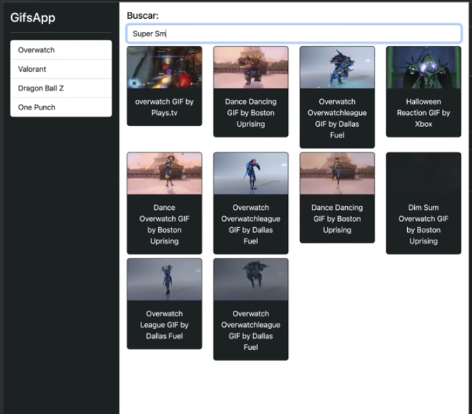

Creamos el nuevo proyecto

```
$ ng new 02-gifsApp
```

Vamos a trabajar con bootstrap, para ellos iremos al sitio oficial y copiaremos el CND link para el CSS únicamente

```
<!-- CSS only -->
<link href="https://cdn.jsdelivr.net/npm/bootstrap@5.2.0-beta1/dist/css/bootstrap.min.css" rel="stylesheet" integrity="sha384-0evHe/X+R7YkIZDRvuzKMRqM+OrBnVFBL6DOitfPri4tjfHxaWutUpFmBp4vmVor" crossorigin="anonymous">
```

Pegamos este link en la sección _head_ del archivo index.html

```
./02-gifsApp/src/index.html
```

Luego borraremos toda la informacion en el archivo _code/udemy-angular/02-gifsApp/src/app/app.component.html_ y crearemos nuestro diseño base HTML:

```html
<div class="d-flex">
  <!-- Este es el sidebar -->
  <div class="bg-dark border-right p-2" id="sidebar">
    <h3 class="text-light">Gifs-App</h3>
    <hr class="text-white" />
    <div class="list-group list-reset">
      <a href="#" class="list-group-item list-group-item-action"> DashBoard </a>
    </div>
  </div>
  <!-- Fin del sidebar -->

  <div class="container">
    <div class="row p-3">
      <div class="col">
        <h5>Buscar:</h5>
        <input type="text" class="form-control" placeholder="Buscar Gifs" />
      </div>
    </div>
    <hr />
    <div class="row">
      <div class="col">Estos es un texto temporal</div>
    </div>
  </div>
</div>
```

Agregamos el siguiente estilo al archivo principal _style.css_

```css
html,
body {
  height: 100%;
}

#sidebar {
  height: 100%;
  min-height: 100vh;
  min-width: 180px;
}
```

Y listo, tenemos un diseño básico de lo que será nuestras APP. En contenedor (en el que aparece el texto temporal) mostrará el resultado de las búsqueda de GIF, y la barra lateral (sideBar) contrentrá la lista de las últimas 10 búsquedas.
<br/>
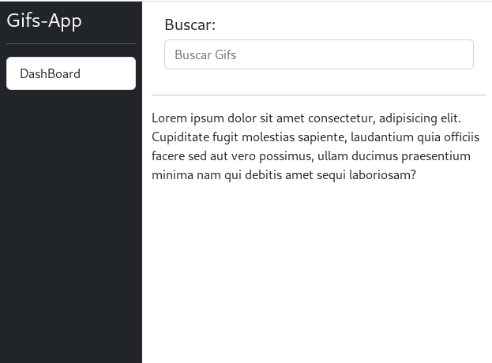

# Crear Módulo y Componente Sidebar

Creamos el Modulo y el Componente:

```
fcruz@dev05 02-gifsApp]$ ng g m shared
CREATE src/app/shared/shared.module.ts (192 bytes)

[fcruz@dev05 02-gifsApp]$ ng g c shared/sidebar
CREATE src/app/shared/sidebar/sidebar.component.css (0 bytes)
CREATE src/app/shared/sidebar/sidebar.component.html (22 bytes)
CREATE src/app/shared/sidebar/sidebar.component.spec.ts (633 bytes)
CREATE src/app/shared/sidebar/sidebar.component.ts (279 bytes)
UPDATE src/app/shared/shared.module.ts (280 bytes)
```

Movemos el HTML del main template hacia _/shared/sidebar/sidebar.component.html_

Hacemos la exportación en el modulo shared del componente creado

Importamos el Módulo Share en el app.module.ts

Inluimos el <app-sidebar> en el template principal y listo.

# Crar nuevo Módulo gifs

Vamos a incluir todas las utilidades referente a los gifs en este módulo.

Generamos el módulo

```
[fcruz@dev05 02-gifsApp]$ ng g m gifs
CREATE src/app/gifs/gifs.module.ts (190 bytes)
```

Y seguidamente lo importamos en el app.module.ts

# Nuevo Complenmente gifs-page

Creamo el componente:

```
[fcruz@dev05 02-gifsApp]$ ng g c gifs/gifsPage --skip-tests -is
CREATE src/app/gifs/gifs-page/gifs-page.component.html (24 bytes)
CREATE src/app/gifs/gifs-page/gifs-page.component.ts (259 bytes)
UPDATE src/app/gifs/gifs.module.ts (284 bytes)
```

NOTA: -is (internal style) omite la creación del archivo css:

Exportamos el componente en el gifs.module.ts

Importamos el modulo gifs en el app.module.ts

Creamos nuestra etiqueta app-gifs-page en nuestro main template

# Crear search Component

La barra de búsquedas será un componente aparte, dentro del módulo de gifs, procedemos:

```
[fcruz@dev05 02-gifsApp]$ ng g c gifs/search --skip-tests -is
CREATE src/app/gifs/search/search.component.html (21 bytes)
CREATE src/app/gifs/search/search.component.ts (275 bytes)
UPDATE src/app/gifs/gifs.module.ts (406 bytes)
```

Este es un componente interno del módulo gifs por lo tanto no lo exportaremos, es de consumo interno.

# Creamos el componente results

Este contendrá los resultados de las búsquedas

Al final hemos separado el diseño original en componentes separados.

<br/>
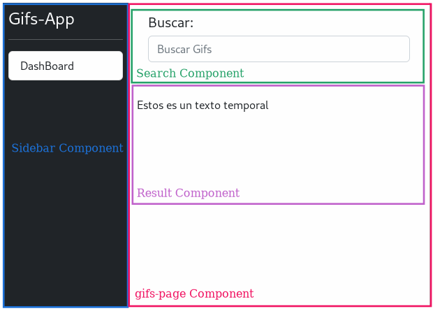

Hasta este punto los templates quedan de la siguiente forma:

El Main template debería de verse mas limpio de HTML:

**app.template.html:**

```html
<div class="d-flex">
  <!-- Este es el sidebar -->
  <app-sidebar></app-sidebar>
  <!-- Fin del sidebar -->

  <!-- Este es el gifs-page component -->
  <app-gifs-page></app-gifs-page>
  <!-- Fin del gifs-page -->
</div>
```

**sidebar.template.html:**

```html
<div class="bg-dark border-right p-2" id="sidebar">
  <h3 class="text-light">Gifs-App</h3>
  <hr class="text-white" />
  <div class="list-group list-reset">
    <a href="#" class="list-group-item list-group-item-action"> DashBoard </a>
  </div>
</div>
```

**gifs-page.template.html**

```html
<div class="container">
  <div class="row p-3">
    <div class="col">
      <app-search></app-search>
    </div>
  </div>

  <hr />
  <div class="row">
    <div class="col">
      <app-results></app-results>
    </div>
  </div>
</div>
```

**search.template.html**

```html
<h5>Buscar:</h5>
<input type="text" class="form-control" placeholder="Buscar Gifs" />
```

**results.template.html**

```html
Esto es un texto temporal
```

Por el momento solo nos hemos enfocado en trasbajar con el HTMl, el código a nivel de componentes.ts es el código por default del CLI.

## Capturar el texto de búsqueda

Para efectos prácticos y dado que solo tenemos un input, no consideramos necesario en este punto usar el FormModule para implementar el two-data-binding, vamos a usar otra técnica: el **@ViewChild**

Tanto ViewChild como ViewChildren son dos decoradores que, utilizados sobre una propiedad de la clase que representa a un componente, permiten obtener las instancias de elementos nativos, directivas y componentes que estén en el template del mismo.

El primer cambio que haremmos es en el componente:

```typescript
import { Component, ViewChild } from '@angular/core';

@Component({
  selector: 'app-search',
  templateUrl: './search.component.html',
})
export class SearchComponent {
  @ViewChild('txtBuscar') txtBuscar: any;

  constructor() {}

  buscar() {
    console.log(this.txtBuscar);
  }
}
```

Como podemos observar, hemos usado el decorador _@ViewChild_ para enlazar un elemento del DOM con una propiedad del Componente

```
@ViewChild('txtBuscar') txtBuscar:any;
```

Con eso indicamos que en el template, vamos a tener un elemento que es identificado por medio de _txtBuscar_ y que vamos a enlazar con una propiedad del componente llamada txtBuscar.

Ademas agregamos un método que imprime en consola un texto.

En la plantilla agregamos dos cosas:

1- Un identificador interno al control input: #txtBuscar

2- Un evento (keyup.enter) que llama al método buscar con el texto del elemento referenciado _txtBuscar.value_

```html
<input
  type="text"
  class="form-control"
  placeholder="Buscar Gifs..."
  (keyup.enter)="buscar(txtBuscar.value)"
  #txtBuscar
/>
```

Pero que imprime ese console.log? Imprime un objeto de tipo _ElementRef_ y no el valor en si, porque lo que estamos enlazando es el Elemento Completo. Entonces podemos cambiar el _any_ por este tipo de datos:

```
@ViewChild('txtBuscar') txtBuscar:ElementRef;
```

Pero ahora tenemos un error, Typescript nos exige que inicialicemos la propiedad, pero como en este caso sabemos que vamos a enlazar dicha propiedad a un elemento del DOM existente haremos uso del operador _!_

```
@ViewChild('txtBuscar') txtBuscar!:ElementRef;
```

Este operador se denomina **Operador de aserción no vacío ** Si el verificador de tipo no puede determinar si una variable es nula o no está definida durante el tiempo de ejecución, también arrojará un error. Podemos saber por nosotros mismos que no estará vacío, pero el verificador de tipos no. Por lo tanto, tenemos que decirle al verificador de tipos que no será nulo y utilizaremos el operador de aserción no nulo.

Listo, itentemos imprimir ahora el valor, si nos vamos al código y escribimos `console.log(this.txtBuscar.nativeElement.` vemos que luego de _nativeElement_ no nos dá permite lsitar más propiedades, para resolver esto tenemos que agregar el tipo de elemento al _ElementRef_ ya que es de tipo genèrico, en este caso como estamos trabajando con un elemento HTML, más especificamente el Input, entonces, finalmente la propiedad debe de quedar definida de la siguiente forma:

```
@ViewChild('txtBuscar') txtBuscar!:ElementRef<HTMLInputElement>;
```

Ahora si podemos decifrar esta línea como: **Estamos definiendo una propiedad denominada txtBuscar que es del tipo ElementRef<HTMLInputElement> y que estamos seguros que no es NULL (porque está definida en el DOM) y que el decorador @ViewChild creará un binding con un elemento en el DOM con un identificador intenot #txtBuscar**

Y ahora si podemos buscar la propiedad _value_ de esta forma he imprimir su valor-

```
    this.txtBuscar.nativeElement.value;
```

En este punto tenemos acceso al control Input, y podríamos manipular dicho control según lo necesitemos, por ejemplo si luego de usar el valor queremos limpiarlo, entonces hariamos esto:

```typescript
buscar() {
    console.log(this.txtBuscar.nativeElement.value);
    this.txtBuscar.nativeElement.value = '';
  }
```


## Cambios en la APP.

Haremos algunos cambios importantes en la configuraciones de los componentes y sus plantillas, se hará una reorganización mas limpia, al final el proyecto queda de esta forma:

Los directorios quedan de esta forma:

```
── app.component.css
├── app.component.html
├── app.component.spec.ts
├── app.component.ts
├── app.module.ts
├── app-routing.module.ts
├── gifs
│   ├── components
│   │   ├── results
│   │   │   ├── results.component.html
│   │   │   └── results.component.ts
│   │   └── search-box
│   │       ├── search-box.component.html
│   │       └── search-box.component.ts
│   ├── gifs.module.ts
│   ├── helpers
│   ├── pages
│   │   └── home
│   │       ├── home-page.component.html
│   │       └── home-page.component.ts
│   └── services
└── shared
    ├── components
    │   └── sidebar
    │       ├── sidebar.component.html
    │       └── sidebar.component.ts
    ├── helpers
    ├── pages
    ├── services
    └── shared.module.ts
```

La aplicación se ha dividido en dos secciones

- gifs
- shared

Gifs contiene los elementos relacionados con renderizar las busqueda de gifs, componentes propiamente requeridos por la applicación para buscar y mostrar los gifs, en cambio shared, son elementos que puedne ser compartidos por otros elementos o secciones dentro de la app, por ejemplo una barra lateral de menú, está podría mostrarse no solo para una página que renderiza los gifs, pero también para cualquier otra página que renderice otro tipo de información dentro de la App. Por ejemplo, supongamos que agregaremos un panel para permitir configurar las busquedas de los gifs, podemos usar otro directorio gifSetUp y dentro de eso crear todos los elementos como componentes, helpers, servicios que muestren las herramientas para configuraciones. Entonces Shared contiene los elementos que se pueden compartir entre todos los componentes (vistas o secciones) de nuestra app

Dentro de cada sección crearemos una estructura de subdirectorios

_components_  Aca se incluyen todos los componentes de la sección, para Gifs tendremos dos componentes, el SearchBox y el Result

_helpers_ Usaremos este directorio para colocar cualquier rutina, función o método que proporcione cierta funcionalidad de ayuda para los demas elementos de esta sección

_pages_ Las páginas son plantillas que agrupan a los componentes dentro de la sección

_services_ Servicios que otorgan utilidad a la sección

## Componentes principales

El template principal _app.component.html_

```html
<div class="d-flex">
  <!-- Este es el sidebar -->
    <shared-sidebar></shared-sidebar>
  <!-- Fin del sidebar -->

  <!-- Este es el gifs-page component -->
    <gifs-home-page></gifs-home-page>
  <!-- Fin del gifs-page -->

</div>
```

El Componente, app.component.ts

```typescript
import { Component } from '@angular/core';

@Component({
  selector: 'app-root',
  templateUrl: './app.component.html',
  styleUrls: ['./app.component.css']
})
export class AppComponent {
  title = '02-gifsApp';
}
```

El enrrutador: app-routing.module.ts

```typescript
import { NgModule } from '@angular/core';
import { RouterModule, Routes } from '@angular/router';

const routes: Routes = [];

@NgModule({
  imports: [RouterModule.forRoot(routes)],
  exports: [RouterModule]
})
export class AppRoutingModule { }

```
y finalmente el módulo


```typescript
import { NgModule } from '@angular/core';
import { BrowserModule } from '@angular/platform-browser';

import { AppRoutingModule } from './app-routing.module';
import { AppComponent } from './app.component';
import { SharedModule } from './shared/shared.module';
import { GifsModule } from './gifs/gifs.module';

@NgModule({
  declarations: [
    AppComponent
  ],
  imports: [
    BrowserModule,
    AppRoutingModule,
    SharedModule,
    GifsModule
  ],
  providers: [],
  bootstrap: [AppComponent]
})
export class AppModule { }
```

## Componente Shared

El template

```html
<div class="bg-dark border-right p-2" id="sidebar">
  <h3 class="text-light">Gifs-App</h3>
  <hr class="text-white">
  <div class="list-group list-reset">
    <a href="#" class="list-group-item list-group-item-action">
      DashBoard
    </a>
  </div>
</div>
```

El componente

```typescript
import { Component, OnInit } from '@angular/core';

@Component({
  selector: 'shared-sidebar',
  templateUrl: './sidebar.component.html'
})
export class SahredSidebarComponent implements OnInit {

  constructor() { }

  ngOnInit(): void {
  }

}
```

No tenemos por el momento helpers ni services ni páginas para esta sección, solamente el Modulo

```typescript
import { NgModule } from '@angular/core';
import { CommonModule } from '@angular/common';
import { SahredSidebarComponent } from './components/sidebar/sidebar.component';


@NgModule({
  declarations: [
    SahredSidebarComponent
  ],
  imports: [
    CommonModule
  ],
  exports: [
    SahredSidebarComponent
  ]
})
export class SharedModule { }
```

## Sección Gifs

Cuenta con dos componentes y una página que los agrupa, 

## Componente search-box

el Template

```html
<h5>Buscar:</h5>
<input
  type="text"
  class="form-control"
  placeholder="Buscar Gifs..."
  (keyup.enter)="buscar()"
  #txtBuscar>
  ```

El componente

```typescript
import { Component, ElementRef, ViewChild } from '@angular/core';

@Component({
  selector: 'gifs-search-box',
  templateUrl: './search-box.component.html'
})
export class SearchBoxComponent {

@ViewChild('txtBuscar') txtBuscar!:ElementRef<HTMLInputElement>;

  constructor() { }

  buscar() {
    console.log(this.txtBuscar.nativeElement.value);
    this.txtBuscar.nativeElement.value = '';
  }

}

```

Ver más sobre el @ViewChild adelante en el documento.

## Componente Result

El template


Por el momento solo tenemos un texto

```html
Lorem ipsum dolor sit amet consectetur, adipisicing elit. Cupiditate fugit molestias sapiente, laudantium quia officiis facere sed aut vero possimus, ullam ducimus praesentium minima nam qui debitis amet sequi laboriosam?
```

El componente

```typescript
import { Component, OnInit } from '@angular/core';

@Component({
  selector: 'app-results',
  templateUrl: './results.component.html'
})
export class ResultsComponent implements OnInit {

  constructor() { }

  ngOnInit(): void {
  }

}
```

## Pages: Componente home-page

Este es un ejemplo de un componente que va en la carpeta _pages_ es un componente que agrupa otros componentes y los presenta como una sola página.

el Template

```html
<div class="container">
  <div class="row p-3">
    <div class="col-12">
      <gifs-search-box></gifs-search-box>
    </div>
  </div>

  <hr>
  <div class="row">
    <div class="col-12 pt-2">
      <app-results></app-results>
    </div>
  </div>
</div>
```

Vemos como se muestran los dos componentes principales de la sección

El Componente

```typescript
import { Component, OnInit } from '@angular/core';

@Component({
  selector: 'gifs-home-page',
  templateUrl: './home-page.component.html',
  styles: [
  ]
})
export class HomePageComponent implements OnInit {

  constructor() { }

  ngOnInit(): void {
  }

}
```


## El Modulo de Gifs

Este es el módulo de la sección Gifs

```typescript
import { NgModule } from '@angular/core';
import { CommonModule } from '@angular/common';
import { HomePageComponent } from './pages/home/home-page.component';
import { SearchBoxComponent } from './components/search-box/search-box.component';
import { ResultsComponent } from './components/results/results.component';


@NgModule({
  declarations: [
    HomePageComponent,
    SearchBoxComponent,
    ResultsComponent
  ],
  imports: [
    CommonModule
  ],
  exports: [
    HomePageComponent,
  ]
})
export class GifsModule { }
```

Y con eso se completa el rediseño de los componentes.

## @ViewChild

Documentación de internet:

En Angular, @ViewChild es un decorador que se utiliza para obtener una referencia a un elemento hijo dentro de un componente. Permite a un componente padre acceder a propiedades o métodos de un componente hijo directamente en el código TypeScript, en lugar de hacerlo a través del DOM.

La sintaxis básica de @ViewChild es la siguiente:


```typescript
@ViewChild(TipoDeElemento) nombreDeVariable: TipoDeElemento;
```

Donde:

    TipoDeElemento es el tipo de elemento que se está buscando. Puede ser un componente, una directiva, o un elemento nativo del DOM.
    nombreDeVariable es el nombre de la variable que se utilizará para referenciar el elemento.

Aquí hay un ejemplo simple para ilustrar cómo se usa @ViewChild:

Supongamos que tienes un componente hijo llamado ChildComponent:


```typescript
import { Component } from '@angular/core';

@Component({
  selector: 'app-child',
  template: '<p>Hola, soy un componente hijo.</p>',
})
export class ChildComponent {
  // ... lógica del componente hijo, si es necesario
}
```

Y ahora, en el componente padre, puedes usar @ViewChild para obtener una referencia a ese componente hijo:


```typescript
import { Component, ViewChild, AfterViewInit } from '@angular/core';
import { ChildComponent } from './child.component';

@Component({
  selector: 'app-parent',
  template: `
    <p>Componente Padre</p>
    <app-child></app-child>
  `,
})
export class ParentComponent implements AfterViewInit {
  @ViewChild(ChildComponent) childComponentRef!: ChildComponent;

  ngAfterViewInit() {
    // Ahora puedes acceder a las propiedades y métodos del componente hijo
    console.log(this.childComponentRef);
  }
}
```
En este ejemplo, @ViewChild se utiliza para obtener una referencia al componente hijo ChildComponent en el componente padre ParentComponent. Después del ciclo de vida ngAfterViewInit, la variable childComponentRef contendrá una referencia al componente hijo, y puedes interactuar con él directamente en el código del componente padre.

Fin de la documentación de internet.

Nuestro componente Search-Box usa este decorador, recordemos el template


```html
<h5>Buscar:</h5>
<input
  type="text"
  class="form-control"
  placeholder="Buscar Gifs..."
  (keyup.enter)="buscar()"
  #txtBuscar>
  ```

El input tiene una referencia #txtBuscar la cual se usará como identificado único para enlazar el text con nuestro código en TypeScript.


En nuestro componente, definimos el enlace de esta forma

```typescript
@ViewChild('txtBuscar') txtBuscar!:ElementRef<HTMLInputElement>;
```

@ViewChild acepta como parámetro el identificador único del componente, a la vez necesita un nombre para la propiedad txtBuscar! (puede ser nullable) y se define el tipo del elemento, en este caso es un HTMLInputElement


Luego, podemos acceder a nuestro elemento de la siguiente forma:
```typescript
   console.log(this.txtBuscar.nativeElement.value);
```

## Servicio Gifs

Vamos a implementar un servicio, lo haremos desde la línea de comando

```
ng g service gifs/services/gifs
```

Esto crea un par de archivo, el más importante _src/app/gifs/services/gifs.service.ts_

Agregaremos una propiedad privada __tagsHistory_ para almacenar la lista de Tags con los que hemos realizado búsquedas.

```
private _tagHistory: string[] = [];
```

A la vez, crearemos un metodo get para obtener la lista de tags (Arreglo)


```
  get tagHistory(): string[] {
    return [...this._tagHistory];
  }
```

Dado que en Js los arreglos se pasan como referencia, y no queremos pasar esa referencia a cualquiera que lo solicite, usamos el operador sread *...* para pasar una copia del arreglo en lugar de la referencia.

Procedemos a crear un nuevo método _searchTag()_ que recibe como parametro el tag de búsqueda y agregara el TAG a nuestro tags history, de paso mantendremos unicamente 10 elementos en nuestro arreglo.

El servicio por el momento es el siguiente:


```typescript
import { Injectable } from '@angular/core';

@Injectable({
  providedIn: 'root'
})
export class GifsService {

  private _tagHistory: string[] = [];

  constructor() { }

  get tagHistory(): string[] {
    return [...this._tagHistory];
  }

  public searchGifs(tag: string): void {
    tag = tag.trim().toLowerCase();
    if (!this._tagHistory.includes(tag)) {
      this._tagHistory.unshift(tag);
      this._tagHistory = this._tagHistory.splice(0, 10);
    }
  }
}
```

Algunas cosas a notar:

Primero, el decorador _@Injectable_ por medio del configurador *providedIn:  'root'* indicamos que cualquier módulo que importe este servicio, automáticamente tiene a su disposición usar dicho servicio.

De Internet:

Cuando se usa  *provideIn: 'root'* en tu servicio, le indicamos a Angular que proporcione el servicio en el inyector raíz. El inyector raíz es el inyector superior en su aplicación del cual heredan todos los demás inyectores. Esto significa que el servicio estará disponible en toda la aplicación. Es una forma de crear un servicio singleton, es decir, de garantizar que una clase de servicio tenga solo una instancia en toda la aplicación.

## Inyectando el nuevo servicio

Regresemos a nuestro search-box Component, en el contructor debemos inyectar el nuevo servicio de la siguiente forma:

```typescript
constructor(private gifsService: GifsService ) { }
```

Dado que el servicio fue agregado al Inyecto Raiz, no es necesario hacer Importaciones o exportaciones en los módulos, simplemente lo inyectamos.

Seguidamente podemos usar los métodos del servicio:

```typescript
const newTag = this.txtBuscar.nativeElement.value.trim().toLowerCase();
this.gifsService.searchGifs(newTag); 
```

## Consumiendo el servicios desde el SideBar

Vamos a imprimir la lista de elementos que tenemos en nuestro *_tagHistory* en el SideBar Component, para ello primero inyectamos el servicio en el componente y luego creamos un metodo publico GET para retornar la lista actual de elementos guardados.

```typescript
export class SahredSidebarComponent {

  constructor(private gifsService: GifsService) { }

  public get tags(): string[] {
    return this.gifsService.tagHistory;
  }
}
```

Seguidamente podemos usar el método Get en nuestro template, y con esto cada vez que agregamos un TAG se mostrará en la Barra lateral.

```html
<button *ngFor="let tag of tags"  class="list-group-item list-group-item-action">
      {{ tag | titlecase}}
</button>
```

El resultado: Veremos como un botón los elementos guardados.

<br/>
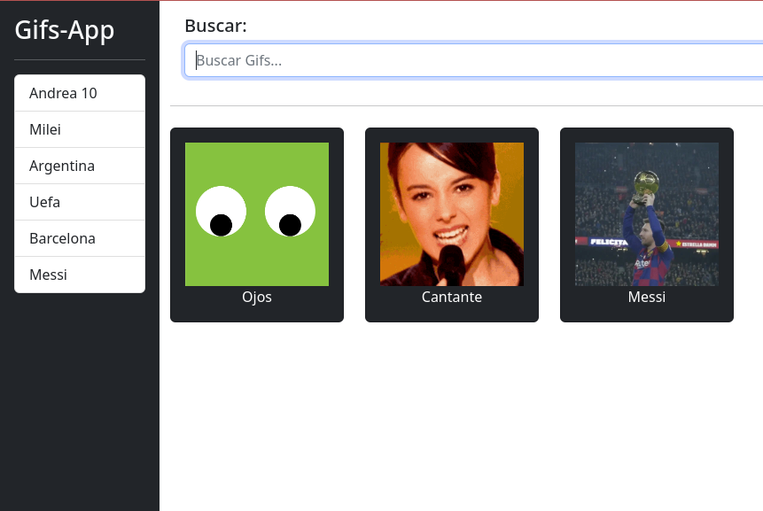


NOTA: Angular está constantemente observando los cambios en los datos y actualizando la vista en consecuencia. Cuando el array _tagHistory en el servicio cambia (debido a la adición de un nuevo tag), Angular detecta este cambio.Angular actualiza automáticamente todas las referencias en las vistas que dependen de estos datos.

## Giphy API key
Vamos a usar un API publico para reliazar busquedas de Gifs

Primero creamos una cuenta en `https://developers.giphy.com/` luego en el Dashboard (`https://developers.giphy.com/dashboard/`) creamos una nueva APP y seleccionamos el API. Esto genera un API key, el cual vamos a usar en nuestra app.

Por el momento usaremos una constante en el servicio para almacenar el API Key, mas adelante usaremos variables de Entorno.

```typescript
/**
 * The GIPHY API key.
 * TODO: Move to environment variables.
 */
const GIPPHY_API_KEY = '******************************';

@Injectable({
  providedIn: 'root'
})
export class GifsService {}
  ```


Para probar el API podemos instalar la extensión Rest Client, creamos un archivo con extensión http en nuestra carpeta root del proyecto y agregamos request como este:

```
GET https://api.giphy.com/v1/gifs/search?api_key=KTsjcCoEj7zWZC0vEgmQDtFd6Fegr8ta&q=funny+cat
```

Luego Ctrl + Click en el URL.

## Obtener Datos 

Podemos implementar un Fetch para realizar búsquedas usando el API, 

```typescript
fetch(`${GIPHY_API_URL}/search?api_key=${GIPPHY_API_KEY}&q=${tag}&limit=10`)
      .then( response => response.json())
      .then( response => {
        console.log(response.data);
      });
```
Pero existe otra forma en angular que permite implementar interceptors, y realizar otras operaciones con la llamada al API, usaremos HttpClientModule


## HttpClientModule

HttpClientModule permite nativamente desde angular implementar, entre otras cosas, llamadas a API en las que podamos aplicar interceptor, programación reactiva, etc. Es un client muy poderoso y se recomienda usarlo en Angular.

Primero en el `app.module.ts` importamos el paquete:


```typescript
import { HttpClientModule } from '@angular/common/http';

@NgModule({
  imports: [
    HttpClientModule
  ]
})
export class AppModule { }
```

Y luego en nuestro servicio lo inyectamos en el constructor:

```typescript
constructor(private http: HttpClient) { }
```

Y luego implementamos el GET de la siguiente forma:

```typescript
this.http.get(`${GIPHY_API_URL}/search?api_key=${GIPPHY_API_KEY}&q=${tag}&limit=10`).subscribe( (response: any) => {
      console.log(response.data);
    });
```

El `this.http.get` regresa un `Observable` el cual es un objeto que a lo largo del tiempo puede estar emitiendo diferentes valores


Un objeto `Observable` permite subscribirse por medio del método `subscribe` eso significa que vamos a estar escuchando las emisiones de ese objeto. Cada vez que emita un valor, vamos a escucharlo y reaccionar a dicho evento. En nuestro caso, es un objeto que emite eventos una sola vez pero igual, debemos de suscribirnos. Esto quiere decir que hay otros Observables que emiten eventos constantemente en el tiempo.

## HttpParams

Continuamos optimizando nuestro código, esta vez lo haremos con los parámetros de la petición. Vamos a implementar un objeto HttpParams (propio de JS, no necesitamos importar nada) y agregaremos nuestros parámetros a dicho objeto, posteriormente lo agregaremos a la petición, el código queda de esta forma:


```typescript
const params = new HttpParams()
      .set('api_key', GIPPHY_API_KEY)
      .set('q', tag)
      .set('limit', GIPHY_SEARCH_LIMIT.toString());

    this.http.get(`${GIPHY_API_URL}/search`, { params }).subscribe( (response: any) => {
      console.log(response);
    });
```

NOTA: `GIPHY_SEARCH_LIMIT` es una constante agregada en el servicio.


## Implementando Tipo de Datos para el API response

El API retorna un objeto con muchos datos, mapear eso a las interfaces manualmente puede ser una tarea complicada, pero podemos usar herramientas que transforman un JSON en las interfaces necesarios, por ejemplo podemos usar [https://app.quicktype.io/](https://app.quicktype.io/)

Pegamos el JSON, seleccionamos el tipo de lenguaje (typescript) y marcamos Solo interfaces, cambiamos el nombre de la interfaz principal a `SearchResponse`, creamos un nuevo archivo: `src/app/gifs/interfaces/gifs.interface.ts` y agregamos todas las interfaces creadas por quicktype.

La interfaz principal `SearchResponse` cuenta con tres campos

```typescript
export interface SearchResponse {
    data:       Gifs[];
    pagination: Pagination;
    meta:       Meta;
}
```

_Data_ es un arreglo de gifs, y es el objeto que contiene los datos mas relevantes. Los almacenaremos en una variable pública `public gifsList: Gifs[] = [];`

NOTA: en este caso usamos una propiedad pública y no una privada con su Get (usando desestructuración) porque esta lista es volátil, cada vez que hacemos una búsqueda, esta lista va a ser reemplazada. Por eso no tiene mucha importancia si un proceso externo al servicio la modifica. Aunque lo ideal es siempre usare el metodo GET con su propiedad privada tal como se hizo con el `private _tagHistory: string[] = [];`

A continuación, vamos a tipar nuestro response, el código siguiente imprime únicamente el título de los gifs en la respuesta:

```typescript
this.http.get<SearchResponse>(`${GIPHY_API_URL}/search`, { params })
    .subscribe( (response) => {
      this.gifsList = response.data;
    });
```

## Mostrar Gifs en Pantalla

Tenemos esta estructura de componentes:

```
app_root
  |
  |-shared-sidebar
  |
  |-gifs-home-page
      |
      |-gifs-search-box
      |
      |-gifs-card-list
```

Tenemos dos opciones:

1. Inyectar el servicio directamente en el _gifs-card-list_
2. Inyectar el servicio en el _gifs-home-page_ y que sea este el que pase los gifs al componente hijo _gifs-card-list_

Con la opción 1, inyectamos directamente el servicio al card list, de modo que únicamente este componente podrá usar la información de los gifs.

La ventaja del item 2 es que podemos posteriormente agregar otro componente al home page que use la información de los gifs, por ejemplo una sección de resumen.

Implementaremos la opción #2.

Inyectamos el servicio y creamos un método _get_ 

```typescript
export class HomePageComponent {

  constructor(private gifsService: GifsService) { }

  get gifs() : Gifs[] {
    return this.gifsService.gifsList;
  } 

}
```

Ahora necesitamos pasar esa información al componente hijo _gifs-card-list_ y lo haremos por medio de un *@Input*  En el componente Card list agregamos este input:

```typescript
export class CardListComponent  {

  @Input() gifs: Gif[] = [];

  constructor() { }

}
```

Nuestro componente hijo está listo para recibir la lista de Gifs desde el padre, para pasar esa información, modificaremos el template del componente _gifs-home-page_ y al momento de definir el componente _gifs-card-list_ pasamos el dato como un parámetro

```html
<div class="row">
    <div class="col-12 pt-2">
      <gifs-card-list [gifs]="gifs"></gifs-card-list>
    </div>
  </div>
```

En este momento el card list puede renderizar en su template la lista de gifs.

## Actualizar el SideBar

En nuestro sideBar Component, ya tenemos el servicio inyectado en el constructor, lo usamos para crear la lista de tags (últimos 10 tags buscandos), vamos a agregar un método que llame nuevamente el servicio para buscar por un tag específico, en este caso, al hacer click en el botón

```typescript
export class SahredSidebarComponent {

  constructor(private gifsService: GifsService) { }

  public get tags(): string[] {
    return this.gifsService.tagHistory;
  }

  public searchTag(tag: string): void {
    this.gifsService.searchGifs(tag);
  }
}
```

Ahora, en nuestro template, usaremos el método _searchTag_

```html
<button
    (click) = "searchTag(tag)" 
    *ngFor="let tag of tags"  
    class="list-group-item list-group-item-action">
      {{ tag | titlecase}}
    </button>
```

Con este cambio, al hacer click en el botón, se dispara nuevamente una búsqueda con el Tag seleccionado.

Veremos como se actualizada el cardListComponent sin hacer mayor cambio, porque la llamada al método _this.gifsService.searchGifs(tag);_ actualizará la pripiedad _this.gifsList = response.data;_ esto hace que en cualquier sitio de nuestro código donde hemos usado esta propiedad, se refresquen los componentes asociados, por ejemplo, en el homePageComponente hicimos esto


```typescript
get gifs() : Gif[] {
    return this.gifsService.gifsList;
  } 
```

El método gifs se usa en la renderización del cardList

```html
<gifs-card-list [gifs]="gifs"></gifs-card-list>
```

Y esto hace que el componente actualice su información en Pantalla.


## LocalStorage
La lisa de TAGS y sus resulados actualmente se pierde cuando recargamos el navegador, vamos a implementar un localstorage, para ello podemos guardar la información en el browser usando localstorage, sessionStorage o las Cookies.

El Localstorage permite un mayor cantidad de datos de almacenamiento y es persistente aunque apaguemos el computador.

El SessionStorage también permite guardar grandes cantdidades de datos pero se pierde cuando cerramos el navegador.

El cookies tambien persisten datos pero a diferencia de los métodos anteriores, el contenido es enviado al backend cuando interactuamos con el.

Implementemos un metodo sencillo en el GigsService

```typescript
/**
   * Save the tag history to the local storage.
   */
  private saveTagHistory(): void {
    localStorage.setItem('history', JSON.stringify(this._tagHistory));
  }
```

Este método debemos llamarlo tan pronto el servicio actualice la lista de Tags.

## Cargar datos guardados

Ahora es momento de cargar los datos guardados en el localstorage la carga nuestra App.

Creamos el método correspondiente para cargar el history desde el localStorage

```typescript
/**
   * Load the tag history from the local storage.
   */
  private loadTagHistory(): void {
    const history = localStorage.getItem('history');
    if (history) {
      this._tagHistory = JSON.parse(history);
      this.searchGifs(this._tagHistory[0]);
    }
  }
```

Necesitamos llamar este método en algún lugar, y lo haremos cuando inyectemos el servicio por primera vez, es decir en el constructor del servicio.


```typescript
export class GifsService {
  constructor(private http: HttpClient) { 
    this.loadTagHistory();
  }
}
```

NOTA: al recargar el browser, si tenemos tags almacenados, veremos que la app siempre carga los gifs del primer TAG, esto es posible porque hemos agregado la siguiente línea de código en nuestro loadTagHistory()

```typescript
this.searchGifs(this._tagHistory[0]);
```

Y con esto ya podemos persistir en el localStorage la lista de TAGS.

## Tarea Adicional 1
Implementaremos una funcionalidad que elimine un Tag específico, para ellos agregaremos un icono de eliminar a la par del TAG en el sideBarComponent y al presionar, eliminaremos ese TAG de la lista.


## Tarea Adicional 2
Permitir cargar GIFS desde el localStorage, cuando se cargue desde el localStorage, agregar un icono a la par del TAG que indique que ha sido cargado desde Memoria.

# Solución ambas tareas

Usando mi cuenta personal, se obtiene un kit the Fontawesome y se agrega en el index.html

```html
<script src="https://kit.fontawesome.com/8de2637909.js" crossorigin="anonymous"></script>
```

Se agrega el método eliminar TAG en el _GifsService_:

```typescript
/**
   * Delete a tag from the tag history.
   * @param tag The tag.
   */
  public deleteTag(tag: string): void {
    this._tagHistory = this._tagHistory.filter( OldTag => OldTag !== tag);
    this.saveTagHistory();
  }
```

Se agrega el método de eliminar en el  _sideBarComponent_

```typescript
public deleteTag(tag: string): void {
    this.gifsService.deleteTag(tag);
  }
```

Se agregan los iconos al template del _sideBarComponent_

```html
<div *ngFor="let tag of tags">
      <div class="d-flex justify-content-between align-items-center">
        <button
          (click)="searchTag(tag)"   
          class="list-group-item list-group-item-action">
          {{ tag | titlecase }}
        </button>
        <span (click)="deleteTag(tag)" class="sb-icon text-white">
          <i class="fa-solid fa-trash-can"></i>
        </span>
        <span (click)="searchTag(tag)" class="sb-icon text-white">
          <i class="fa-solid fa-rotate"></i>
        </span>
      </div>
    </div>
```


## Nueva Seccion - Image Loader 

¿Qué veremos en esta sección?

El objetivo principal de la sección es poder aprender a realizar un loading mientras la imagen se carga, pero indirectamente haremos:

    @Inputs

    @Outputs

    Custom Components

    Validaciones

    Importación de módulos personalizados

## Crear un nuevo componente

Antes de comenzar con esta sección, vamos a crear un componente para mostrar un Gif. Actualmente tenemos un _gif-card-list_ y este, recorre la lista de gifs[] y renderiza los gifs en una especie de cartilla. Pues crearemos un componente que renderiza un gif especifico (recibirá como @Input el gif) y dicho componente los llamaremos en el _gif-card-list_


  Usando el ng Client:

  ```
  ng g c gif-card
  ```

  En el template del nuevo componente moveremos el código html que teniamos en el ciclo del *gifCardListComponent*

  ```html
  <div class="card mb-2 text-center bg-dark">
    <div class="card-body text-white">
        
        <p class="card-text">
            {{ gif.title }}
        </p>
    </div>
</div>
```

El código de typescript para este nuevo componente debera:
1- Aceptar un gif como parámetro de entrada
2- Validar que le gif ha sido proporcionado, osea, que no sea null.


```typescript
@Component({
  selector: 'gifs-gif-card',
  templateUrl: './gif-card.component.html',
  styleUrls: ['./gif-card.component.css']
})
export class GifCardComponent implements OnInit {

  constructor() { }

  @Input() gif!: Gif;

  ngOnInit(): void {
    if (!this.gif) {
      throw new Error('GifCardComponent: gif is required');
    }
  }
}
```

Ahora necesitamos cambiar el template del *gifCardListComponent* para llamar este componente y proprcionar el gif específico a renderizar

```html
<div class="row">
    <gifs-gif-card 
        [gif]="gif"
        *ngFor="let gif of gifs " 
        class="col-md-2 col-sm-6">
    </gifs-gif-card>
</div>
```

Y listo, tenemos nuevamente la aplicación funcionando como antes, solo que esta vez, tenemos un nuevo componente para renderizar un único gif. Esto nos ayudara a reutilizar este componente, supongamos que al hacer click abrimos una nueva sección, y parte de esa sección es mostrar el gif seleccionado en un card, con este componente podremos hacer eso facilmente.

## Lazy Image

Implementaremos la carga perezosa de imagenes por medio de un componente, dado que podemos reutilizar esta funcionalidad con cualquier imagen, vamos a colocar el componente en nuestro Shared. 

Shared puede ser luego copiado integramente a otros proyecto, de modo que todos estos componentes estarán disponibles para su uso inmediato en otra aplicación.

Primero agreamos el componente:

```typescript
import { Component } from '@angular/core';

@Component({
  selector: 'shared-lazy-image',
  templateUrl: './lazy-image.component.html',
  styleUrls: ['./lazy-image.component.css'],
})
export class LazyImageComponent { 


}
```

Luego lo declaramos y exportamos en el *SharedModule*

```typescript
@NgModule({
  declarations: [
    SahredSidebarComponent,
    LazyImageComponent
  ],
  imports: [
    CommonModule
  ],
  exports: [
    SahredSidebarComponent,
    LazyImageComponent
  ]
})
export class SharedModule { }
```

Hasta aca, el componente puede ser usado por todo aquel módulo que importe el *SharedModule*

Ahora, importamos el módulo donde queremos usarlo, en el *GifsModule* Solamente lo incluimos en la sección _imports_


```typescript
@NgModule({
  imports: [
    SharedModule
  ]
})
export class GifsModule { }
```

Con este cambio ya podemos usar el *LazyImageComponent* dentro de nuestro *GifsModule*

Ahora implementaremos la funcionalidad del *LazyImageComponent* agregaremos una propiedad  @Input _src_ que será el URL del recurso a cargar (imagen o Gif), validaremos que el OnInit que el URL ha sido proporcionado. Y tambien una propiedad nullable para mostrar el ALT Text. Tambien implementaremos un flag, hasLoaded, para determinar cuando ha sido cargada la imagen. El objetivo es que mientras la imagen no ha sido cargada, mostremos el Spinner, una vez cargada ocultamos el spinner y se muestra la imagen.

El compomente será:

```typescript
  @Component({
    selector: 'shared-lazy-image',
    templateUrl: './lazy-image.component.html',
    styleUrls: ['./lazy-image.component.css'],
  })
  export class LazyImageComponent implements OnInit {

    constructor() { }

    @Input() src!: string;
    @Input() alt: string = '';

    public hasLoaded: boolean = false;

    ngOnInit(): void {
      if (!this.src) {
        throw new Error('Attribute src is required');
      }
    } 

    onLoad() {
      this.hasLoaded = true;
    }
  }
```

El template de nuestro LazyLoader será

```html
<div class="d-flex justify-content-center">
    

    
</div>
```

Inicialmente el componete tiene el flag _hasLoaded_  en *false* este es el estado inicial y mostrará el spinner.

En la primer imagen, tenemos un _(load)="onLoad()_ esto significa que una vez cargada la imagen, se llama el método _onLoad()_

El método _onLoad()_ cambia el flag _hasLoaded_ a *true*

A continuación esto oculta el spinner _*ngIf="!hasLoaded"_ y muestra la imagen _[ngStyle]="{ display: hasLoaded ? '' : 'none'}">_


Ahora implementemos el *LazyImageComponent* en nuestro template del _gif-card-component_, el cual luce de esta forma antes de este cambio:

```html
<div class="card mb-2 text-center bg-dark">
    <div class="card-body text-white">
        
        <p class="card-text">
            {{ gif.title  || 'No title'}}
        </p>
    </div>
</div>
```

En ese template, vamos a implementar nuestro _shared-lazy-image_ es decir reemplazamos el __ por esta línea:

```html
<shared-lazy-image [src]="gif.images.downsized_medium.url" [alt]="gif.title"></shared-lazy-image>
```

Y listo, al cargar la página vemos un spinner y cuando la imagen ha sido cargada es mostrada.

<br/>
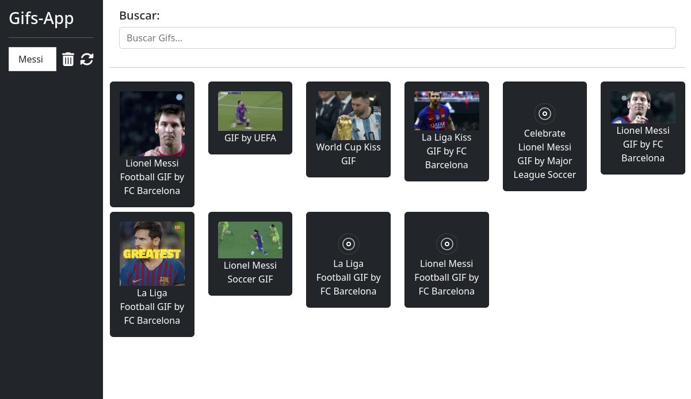

## Animaciones con CSS

Sitio: [https://animate.style/](https://animate.style/)

Colocamos en nuestro index.html

```html
<link
    rel="stylesheet"
    href="https://cdnjs.cloudflare.com/ajax/libs/animate.css/4.1.1/animate.min.css"
  />
```

Y luego podemos usar las classes para agregar efectos, por ejemplo, agregar un FadeIn de 400ms cuando se carga la imagen:

*animate__animated animate__fadeIn animate__delay-400ms*

```html

```

<div style="page-break-after: always;"></div>

# Nueva Sección: SPA
_Single Page Application_

## ¿Qué veremos en esta sección?

Este es un breve listado de los temas fundamentales:

  Rutas

  RouterLink y RouterLinkActive

  Componentes especializados

  DebounceTime

  Inputs

  SwitchMaps

  Consumo de APIs

  Tipado de datos

  Menú de aplicación
  
  Y más

En esta sección daremos los fundamentos de una aplicación SPA (Single Page Application), y luego, las seguiremos haciendo pero mediante carga perezosa (lazyload), esta es otra aplicación real que nos enseñara mucho de cómo funciona Angular y como la información fluye en ella.
<div style="page-break-after: always;"></div>


Muestra de la APP: 


<br/>
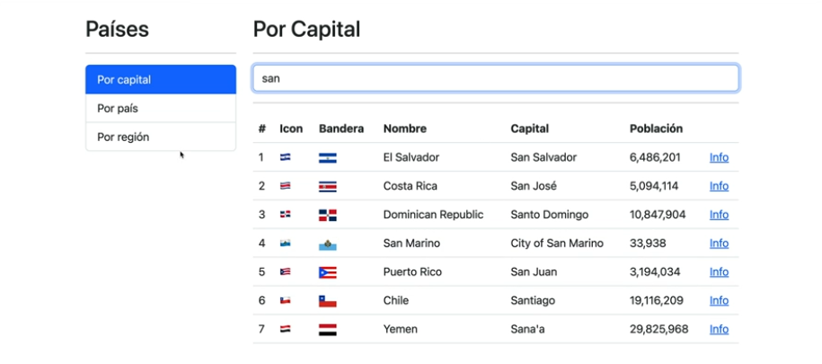

Mostrando información de un País en específico:

<br/>
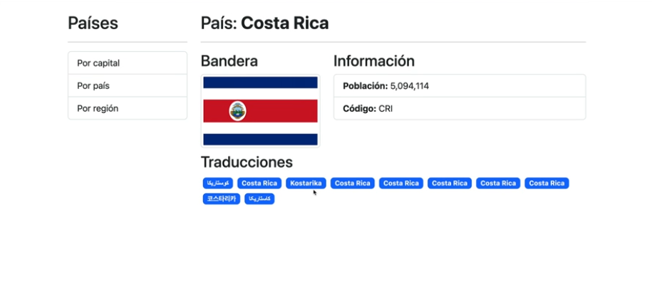

<div style="page-break-after: always;"></div>
## Crear nuevo proyecto:

Configuraciones iniciales:

```
[fcruz@fedora udemy-angular]$ ng new 03-countryApp --standalone=false
? Which stylesheet format would you like to use? CSS
? Do you want to enable Server-Side Rendering (SSR) and Static Site Generation (SSG/Prerendering)? No
```


Agregar Bootstrap, Animate y fontawesome
```html
<!-- CSS only -->
  <link href="https://cdn.jsdelivr.net/npm/bootstrap@5.2.0-beta1/dist/css/bootstrap.min.css" rel="stylesheet" integrity="sha384-0evHe/X+R7YkIZDRvuzKMRqM+OrBnVFBL6DOitfPri4tjfHxaWutUpFmBp4vmVor" crossorigin="anonymous">
  <link
    rel="stylesheet"
    href="https://cdnjs.cloudflare.com/ajax/libs/animate.css/4.1.1/animate.min.css"
  />
  
  <script src="https://kit.fontawesome.com/8de2637909.js" crossorigin="anonymous"></script>
  ```

  Agregar la Clase Container al body

  ```html
  <body class="container">
  ```

  Borramos el Template del APP y listo, podemos iniciar.

  ## Modulos
  Vamos a crear un SPA (Single Page Application) y nos vamos a basar en dos módulos con varias páginas cada uno. Por el momento creamos ambos módulos:

```
[fcruz@fedora 03-countryApp]$ ng g m countries
CREATE src/app/countries/countries.module.ts (195 bytes)
[fcruz@fedora 03-countryApp]$ ng g m shared
CREATE src/app/shared/shared.module.ts (192 bytes)
[fcruz@fedora 03-countryApp]$ 
```

La carga del *countries.module* se hará de modo LazyLoading, es decir, no se va a cargar inicialmente, en cambio el módulo *shared.module* se será cargado desde un inicio, por lo tanto, agregaremos el *shared.module* en la sección de _imports_ de nuestro *app.module*

## Router Module y Páginas SPA

En la carpeta _app/shared_ crearemos dos directorios: _components_ y _pages_ y dentro de pages vamos a crear dos componentes: _shared-home-page_ y _shared-about-page_


```
[fcruz@fedora app]$ tree
.
└── app
   ├── countries
   │   └── countries.module.ts
   └── shared
       ├── components
       ├── pages
       │   ├── aboutPage
       │   │   ├── aboutPage.component.css
       │   │   ├── aboutPage.component.html
       │   │   └── aboutPage.component.ts
       │   └── homePage
       │       ├── homePage.component.css
       │       ├── homePage.component.html
       │       └── homePage.component.ts
       └── shared.module.ts

```

LA idea es implementar un Router que permita carga uno de los dos componentes dependiendo del URL

_/home_ cargará el *homePageComponent* y _/about_ el *aboutPageComponent*

Archivo: _src/app/app-routing.module.ts_

```typescript
const routes: Routes = [
  {
    path: 'home',
    component: HomePageComponent
  },
  {
    path: 'about',
    component: AboutPageComponent
  },
  {
    path: '**',
    redirectTo: 'home'
  }
];

@NgModule({
  imports: [RouterModule.forRoot(routes)],
  exports: [RouterModule]
})
export class AppRoutingModule { }
```

Analicemos el Router, se crea un arreglo de tipo _Routes_, este objetos _{}_ el cual, por el momento contiene un _path_ el URL section, y un _component_, el que se debe cargar si el URL hace match.

Luego, como este es el Routing principal usaremos _forRoot_, en el import: _RouterModule.forRoot(routes)_ 

Finalmente exportamos el módulo ya que luego debemos importarlo en el App.module.

Y luego, en el template principal _src/app/app.component.html_ agregamos un _router-outlet_ el cual actúa como un marcador de posición que Angular llena dinámicamente según el estado actual del enrutador.

```html
<div class="col">
    <router-outlet></router-outlet>
  </div>
```

Listo, si cargamos el URL _http://localhost:4200/home_ mostrará el _homeComponent_ y si por el contrario cargamos el URL _http://localhost:4200/about_ entonces mostrará el _aboutComponent_

## Router Link 

Construiremos una barra de navegación para que al hacer click podamos cambiar entre componentes (home o about) sin necesidad de recargar el URL.

Crearemos un *SidebarComponent* en la carpeta _Shared_ que servirá de barra de navegación, el template es el siguiente:


```html
<h2>Países</h2>
<hr>

<ul class="list-group">
    <li
    routerLink="home"
    routerLinkActive="active"
    class="list-group-item">
        Home
    </li>
    <li 
    routerLink="about"
    routerLinkActive="active"
    class="list-group-item">
        About
    </li>
</ul>
```

Notar que cada elemento del menú _li_ tiene una propiedad [routerLink] con un valor del _path_ que agregamos anteriormente a nuestro Router. Pero para que  Angular reconozca el [routerLink] como una propiedad de elemento _li_ debemos importar el _AppRoutingModule_ en nuestro _SharedModule_ Si no importamos el Routing Module, nos dará un error.

Con respecto a _routerLinkActive_ lo que perite es agregar la clase _acive_ al elemento seleccionado, se mostrará en azul.

Con estos cambios, al hacer click en cada elementos, veremos como se carga el componente indicado.

NOTA: También podemos usar el RouterLink de la siguiente forma

```html
<li
    routerLink="home"
    class="list-group-item">
        Home
    </li>
```

La versión con los _[]_ permite asignar dinámicamente los path a cada elemento, la segunda forma es mas estática.

Aplicamos los mismos pasos para agregar un ContactPageComponent y la aplicación por el momento debe de verse asi


<br/>
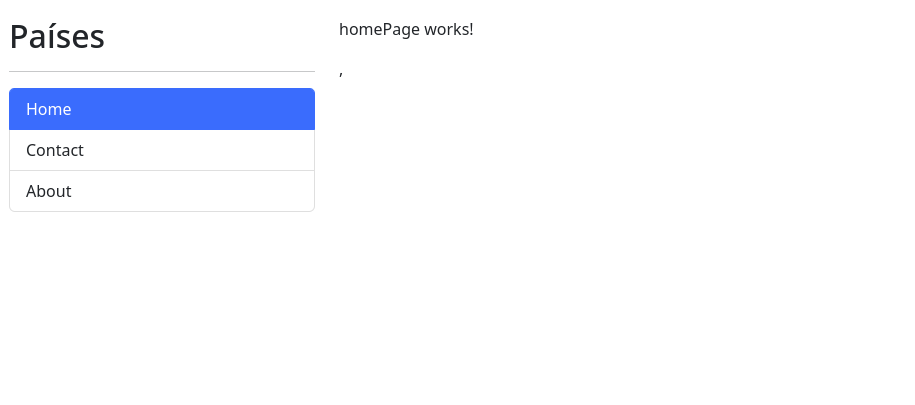


## Crear estrutura de Counties

Vamos a crear la estructura de directorios y a la vez agregaremos componentes y muy importante, Crearemos un CoutriesRoutingModule, es decir un sistema de rutas específico para nuestra seccion de Countries. Este será agregado como un ChildRoutingModule, porque la APP solo permite teneru un RootRouting que ya lo hemos creado.

Comenzamos creando algunas carpetas _components_, _services_, _pages_, _interfaces_ y agregamos componentes:


```
[fcruz@fedora 03-countryApp]$ ng g c countries/pages/byCapitalPage --inline-style   --skip-tests 
CREATE src/app/countries/pages/by-capital-page/by-capital-page.component.html (30 bytes)
CREATE src/app/countries/pages/by-capital-page/by-capital-page.component.ts (200 bytes)
UPDATE src/app/countries/countries.module.ts (317 bytes)
```

De la misma forma crearemos los siguientes componentes:

```
$ ng g c countries/pages/byCountryPage --inline-style   --skip-tests 
$ ng g c countries/pages/byRegionPage --inline-style   --skip-tests 
$ ng g c countries/pages/countryPage --inline-style   --skip-tests 
```

NOTA: Todos los componentes se crean con el prefijo _app_ en el Selector, cambiemos ese prefijo, en este caso por _countries_

```typescript
selector: 'app-country-page',
```
Cambiar por

```typescript
selector: 'countries-country-page',
```

Repetimos el cambio para los componentes que acabamos de crear.

## Crear sistema de rutas para Countries

Como se ha mencionado, vamos a crear un módulo de rutas específico para la sección _Countries_ este contendrá las rutas apuntando a las páginas que acabamos de crear.

```typescript
const routes: Routes = [
    {
        path: 'by-capital',
        component: ByCapitalPageComponent
    },
    {
        path: 'by-country',
        component: ByCountryPageComponent
    },
    {
        path: 'by-region',
        component: ByRegionPageComponent
    },
    {
        path: 'by/:id',
        component: CountryPageComponent 
    },
];

@NgModule({
    imports: [
        RouterModule.forChild(routes)
    ],
    exports: []
})
export class CountriesRoutingModule { }
```

Luego tenemos que agregar en la lista de _imports_ del _CountriesModule_

```typescript
@NgModule({
  declarations: [
    ByCapitalPageComponent,
    ByCountryPageComponent,
    ByRegionPageComponent,
    CountryPageComponent
  ],
  imports: [
    CommonModule,
    CountriesRoutingModule,
  ]
})
export class CountriesModule { }
```

La estructura final de Countries luce de esta forma:

```
.
├── components
├── countires-routing.module.ts
├── countries.module.ts
├── interfaces
├── pages
│   ├── by-capital-page
│   │   ├── by-capital-page.component.html
│   │   └── by-capital-page.component.ts
│   ├── by-country-page
│   │   ├── by-country-page.component.html
│   │   └── by-country-page.component.ts
│   ├── by-region-page
│   │   ├── by-region-page.component.html
│   │   └── by-region-page.component.ts
│   └── country-page
│       ├── country-page.component.html
│       └── country-page.component.ts
└── services

```

Hasta el momento, las rutas no están siendo "comprendidas" por la APP porque no hemos usado el _countries.module.ts_ quien tiene todas las declaraciones, imports y exports. Lo veremos en la próxima sección, ya que vamos a implementar una carga Lazy. Es decir, únicamente cuando el usuario lo demande.

## LazyLoad

No vamos a agregar el *CountriesRoutingModule* en el *AppModule* porque eso significa carga el módulo completo desde que iniciamos la APP, lo que buscamos es cargar por demanda el Módulo. Para ello primero necesitamos un punto de entrada, es decir una ruta que nos permita cargar el Counties. Agregamos una nueva ruta en nuestro Root.


```typescript
const routes: Routes = [
  {
    path: 'home',
    component: HomePageComponent
  },
  {
    path: 'about',
    component: AboutPageComponent
  },
  {
    path: 'contact',
    component: ContactPageComponent
  },
  {
    path: 'countries',
    loadChildren: () => import('./countries/countries.module').then(m => m.CountriesModule)
  },
  {
    path: '**',
    redirectTo: 'home'
  }
];
```

Notar como el path de _counties_ no carga un componente directamente, carga un módulo usando _loadChildren_ el cual es un  objeto que especifica rutas secundarias con carga diferida.

Por el momento, si cargamos el url _http://localhost:4200/countries_ notaremos que no se carga ningun componente, unicamente el sideBar

<br/>


Si cargamos los URL hijos: 

_http://localhost:4200/countries/by-country_

<br/>
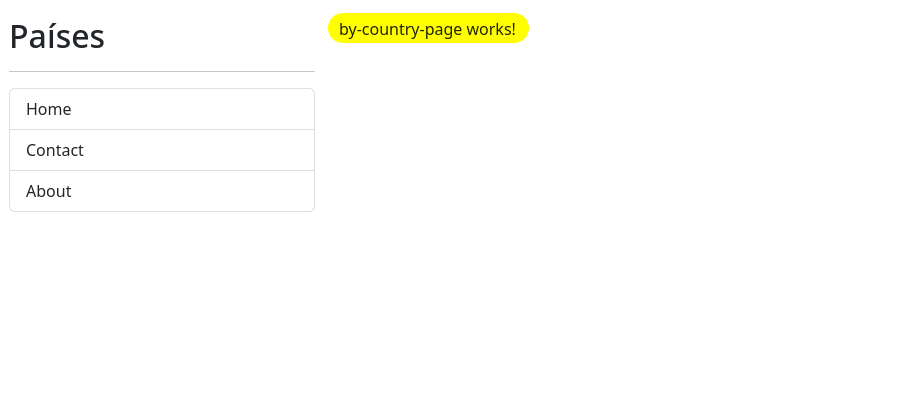

Ahora, podemos usar esta configuración para agregar más opciones al menú, por ejemplo, en nuestro sideBar podemos agregar las búsquedas por capital, region, país

```html
<li 
    routerLink="countries/by-capital"
    routerLinkActive="active"
    class="list-group-item">
        By Capital
    </li>
    <li 
    routerLink="countries/by-region"
    routerLinkActive="active"
    class="list-group-item">
        By Region
    </li>
    <li 
    routerLink="countries/by-country"
    routerLinkActive="active"
    class="list-group-item">
        By Country  
    </li>
```
Ahora podemos ver las opciones en el SideBar.

NOTA: Las opciones del HOME | CONTACT | ABOUT pueden ser eliminadas, solamente fueron usadas para propósito de explicar el Routing. La Aplicación únicamente mostrará las opciones para filtar por CAPITAL | REGION | PAIS

<br/>
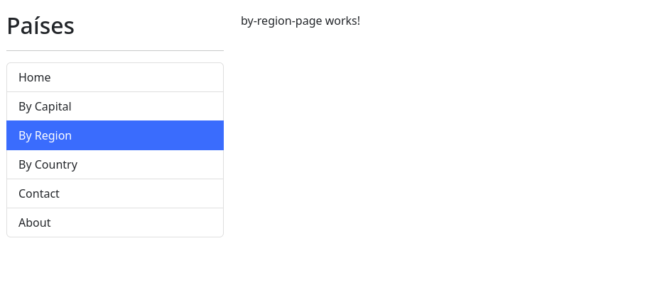


## Build y Lazy Files

Los cambios realizados permiten cargar de manera perezosa el módulo *CountriesModule* de modo que hasta  que hacemos click en uno de los links nuevos, el browser solicitará un archivo adicional (chunk) el cual contiene el código JS del módulo *CountriesModule*


Esto lo podemos ver también en el *build*, podemos notar que existe una sección *Lazy Chunk Files*, este se carga tan pronto hacemos click por primera vez en uno de los links nuevo.

```
fcruz@fedora 03-countryApp]$ ng build

Initial Chunk Files   | Names            |  Raw Size | Estimated Transfer Size
chunk-RZ5F67RC.js     | -                | 200.00 kB |                53.86 kB
polyfills-LZBJRJJE.js | polyfills        |  32.69 kB |                10.59 kB
main-AE5FO73B.js      | main             |   2.90 kB |               820 bytes
styles-5INURTSO.css   | styles           |   0 bytes |                 0 bytes

                      | Initial Total    | 235.59 kB |                65.25 kB

Lazy Chunk Files      | Names            |  Raw Size | Estimated Transfer Size
chunk-6OYRYQCF.js     | countries-module |   1.49 kB |               363 bytes

Application bundle generation complete. [3.172 seconds]
```

## Cambios en RedirectTo

Haremos un cambio adicional con las rutas, actualmente al carga la applicación desplieuga el URL _http://localhost:4200/home_ y muestra el HomePageComponent. Queremos que por defecto cargue el _by Capital_

Lo único que necesitamos cambiar es el redirectTo del comodin _**_ en nuestro Root Router, en lugar de 'home' usar el 'countries/by-capital'

```typescript
{
    path: '**',
    redirectTo: 'countries/by-capital'
  }
```

Otra forma de hacerlo y quizás mejor es definir rutas por default en cada router, en este caso en el router ROOT podemos definir únicamente el redoretTo a 'countries' 

```typescript
{
    path: '**',
    redirectTo: 'countries'
  }
```

Y, en el *CountriesRoutingModule* definimos también un default path


```typescript
{
        path: '**',
        redirectTo: 'by-capital'
    }
```

Y recordemos que el URL _by-caputal_ navega al componente *ByCapitalPageComponent*, regla que ha sido definida en el mismo *CountriesRoutingModule*


```typescript
 {
        path: 'by-capital',
        component: ByCapitalPageComponent
    }
```


## Nuevo Componente SearchBox

Para realizar las búsquedas vamos a crear un nuevo componente, la idea es crear un componente que pueda ser reutilizado por cualquier tipo de búsqueda, de modo que vamos a tener que enviar algunos parametros, y el componente tendrá que emitir el valor a buscar, para que sea el componente padre, el que llame el servicio correspondiente. El componente estará ubicado en el directorio _Shared_

Agregamos el _ShareSearchBoxComponent_

Template:

```html
<input 
type="text"
[placeholder]="placeholder"
class="form-control"
(keyup.enter)="searchBy()"
#txtSearchInput>
```

Typescript:

```typescript
export class SearchBoxComponent {

  @Input() public placeholder: string = 'Search...';

  @ViewChild('txtSearchInput') txtSearchInput!: ElementRef<HTMLInputElement>;

  @Output() onNewSearch: EventEmitter<string> = new EventEmitter();

  public searchBy() {
    if (this.txtSearchInput.nativeElement.value.length == 0) 
      return;

    this.onNewSearch.emit(this.txtSearchInput.nativeElement.value);
  }
}
```

Aca podemos observar:

*Input placeholder* Este control necesita que quien lo implemente le envíe el texto a mostrar en el placeholder.

*@ViewChild('txtSearchInput')* El template tiene un elemento _#txtSearchInput_ el cual lo hacemos visible en el typescript para poder acceder directamente a su valor.

*@Output() onNewSearch: EventEmitter<string>* Esto indica que el component EMITE un valor string, el valor ingresado por el usuario, y el componente padre debe capturarlo para realizar la búsqueda correspondiente.


## Implementando el SearchBoxComponent

Vamos a implementarlo en el _ByCapitalPageComponent_

Primero debemos agregarlo en el template la referencia al control

```html
<shared-search-box
        placeholder="Search by Capital"
        (onNewSearch)="searchByCapital($event)">
</shared-search-box>
```

Tal como lo mencionamos, el que implemente este control debe de enviar un valor para el *PlaceHolder* y debe esperar un evento *(onNewSearch)*

El evento *onNewSearch* es capturado y a la vez llama el método *searchByCapital*

Finalmente el código del control, tiene el método para iniciar la búsqueda.

```typescript
export class ByCapitalPageComponent {

  public searchByCapital(term: string) {
    //TODO call the service
  }
}
```

De la misma forma podemos implementar el mismo control *SearchBoxComponent* en los otros componente:

- ByCountryPageComponent
- ByRegionPageComponent

## Countries API

Usaremos el API de [https://restcountries.com/](https://restcountries.com/)

Usaremos este ENDPOINT y le enviaremos una capital para obtener una muestra de los datos.

https://restcountries.com/v3.1/capital/{capital}

Copiaremos el JSON de respuesta y lo vamos a transformar en una serie de interfaces que las guardaremos en el archivo *country.interface.ts*

Podemos usar la extensión: *Paste JSON as Code*, abrimos el archivo *country.interface.ts*, luego en la linea de comandos de Code (ctrl + p) escribimos _Paste json as code_ y le damos el nombre de la interfaz raiz _countries_ y listo, solo necesitamos tener en el clipboard el JSON respuesta.

Tambien podemos usar el sitio web [https://app.quicktype.io/](https://app.quicktype.io/) que es del mismo proveedor de la extensión.

Verificamos las interfaces creadas.


## Nuevo Servicio

Con el Angular CLI Creamos un nuevo servicio

```
[fcruz@fedora app]$ ng g s countries/services/countries.service.ts
CREATE src/app/countries/services/countries.service.ts.service.spec.ts (419 bytes)
CREATE src/app/countries/services/countries.service.ts.service.ts (147 bytes)
```

Y agregamos el siguiente código

```typescript
@Injectable({
  providedIn: 'root'
})
export class CountriesServiceTsService {

  private apiUrl: string = 'https://restcountries.com/v3.1';

  constructor(private httpClient: HttpClient) { }

  /**
   * Search countries by Capital
   * @param term string
   * @returns Observable<Country>
   */
  searchByCapital(term: string): Observable<Country[]> {
    const url = `${this.apiUrl}/capital/${term}`;
    return this.httpClient.get<Country[]>(url);
  } 
}
```

NOTA Importante: Aca estamos usando el _HttpClient_

```
import { HttpClient } from '@angular/common/http';
```

No solo basta con el _import_ en este caso tenemos que Importar el *HttpClientModule*. Dónde lo haremos? tiene que ser en un Módulo de la APP, si las peticiones REST las haremos en todos los componentes, lo ideal es agregarlo al archivo *app.module.ts* 

```typescript
@NgModule({
  declarations: [
    AppComponent
  ],
  imports: [
    HttpClientModule
  ],
  providers: [],
  bootstrap: [AppComponent]
})
export class AppModule { }
```

Si omitimos este paso, vamos a tener un error:

```
ERROR NullInjectorError: R3InjectorError(_CountriesModule)[_CountriesService -> _CountriesService -> _HttpClient -> _HttpClient]: 
  NullInjectorError: No provider for _HttpClient!
```

*La razón por la cual necesitas importar HttpClientModule es porque HttpClient es un servicio proporcionado por Angular, y estos servicios deben ser registrados en un módulo para que Angular pueda inyectarlos correctamente en los componentes y servicios que los utilizan.*


Regresando al Servicio, el código es bastante simple, el método principal recibe un término de búsqueda, puede ser una capital o simplemente cualquier palabra, el API puede retornar un arreglo de objetos o países, por ejemplo si envíamos el término *San*, podría retornar 
 - San Marino
 - Yemen
 - Chile
 - El Salvador
 - Puerto Rico
 - Dominican Republic
 - Costa Rica

Por lo tanto debemos esperar un arreglo de paises *Country[]*

El *httpClient.get* retorna un *Observable* del mismo tipo *Country[]* 

NOTA: *Country* es la interfaz que creamos en el paso anterior.

## Implementando el Servicio

La búsqueda por Capital va a ser usada por el componente *ByCapitalPageComponent* Inyectaremos el Nuevo servicio. El código del componente queda de la siguiente forma:

```typescript
@Component({
  selector: 'countries-by-capital-page',
  templateUrl: './by-capital-page.component.html',
  styles: ``
})
export class ByCapitalPageComponent {

  private countries: Country[] = [];

  constructor(private countryService: CountriesService) { }

  public get getCountries(): Country[] {  
    return this.countries;
  }

  public searchByCapital(term: string) {
    this.countryService.searchByCapital(term)
      .subscribe(
        (countries) => {
          this.countries = countries;
        });
  }
}
```

Posteriormente podemos mostrar rápidamente en una lista el nombre de los países, en el template colocamos esto:

```html
<div class="row">
    <div class="col">
        <ul>
            <li *ngFor="let country of getCountries">
                 {{ country.name.common }} - {{ country.capital}}
            </li>
        </ul>
    </div>
</div>
```

El resultado para el término _San_ es:


<br/>
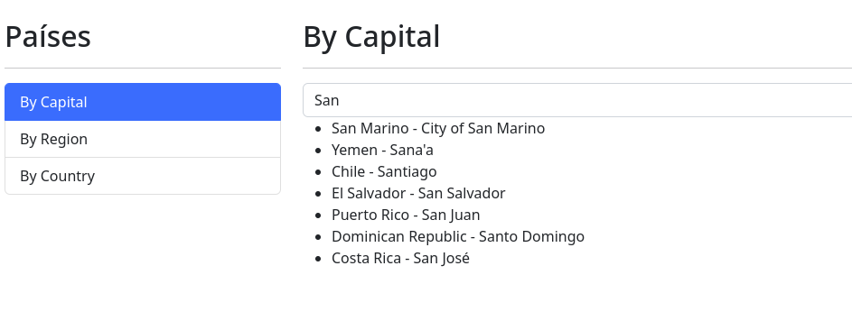

## Country Table
Implementaremos un nuevo control, para mostrar los países en una tabla.

```
[fcruz@fedora app]$ ng g c countries/countryTable
```

En el template del nuevo componente creamos por el momento una tabla HTML

```html
<div *ngIf="countries.length === 0; else table"   class="alert alert-warning text-center">
    No countries to list!
</div>


<ng-template #table>
    <table class="table table-hover">
        <thead>
            <tr>
                <th>#</th>
                <th>Icon</th>
                <th>Name</th>
                <th>Capital</th>
                <th>Population</th>
                <th>  </th>
            </tr>
        </thead>
        <tbody>
            <tr *ngFor="let country of countries; index as rnum">
                <td>{{rnum + 1}}</td>
                <td>
                    {{country.flag}}
                </td>
                <td>{{country.name.common}}</td>
                <td>{{country.capital}}</td>
                <td>{{country.population | number}}</td>
                <td></td>
            </tr>
        </tbody>
    </table>
</ng-template>
```

En código del componente:

```typescript
@Component({
  selector: 'countries-country-table',
  templateUrl: './country-table.component.html',
  styleUrl: './country-table.component.css'
})
export class CountryTableComponent {

  @Input() public countries: Country[] = [];
}
```

En la sección de *declarations* del *CountriesModule*  agregamos el nuevo componente CountryTableComponent. Aunque el componente esta definido dentro de la misma seccón, debemos de hacerlo vivible en el mismo módulo.

Luego en el template del componente ** borramos el _UL_ temporal que habíamos creado y agregamos el nuevo componente:

```html
<div class="row">
    <div class="col">
        <countries-country-table [countries]="getCountries"> </countries-country-table>
    </div>
</div>
```

Recordemos que el *getCountries* retorna la lista de Países que generó la última búsqueda.


## CatchERror: Manejo de Errores en Observables
ACtualmente no tenemos ninún manejador de errores, cuando hacemos la búsqueda de con un término que no genera resultados, obtenemos, del lado del servicio, un _404_. Si la tabla ya tiene resultados, da la impresión al usuario que el nuevo término generó los mismos resultados. 

Lo que haremos es implementar un _catchError_ del lado del servicio y si ocurre un error, entonces retornamos un arreglo vacío.

El código actualizado es el siguiente:

```typescript
/**
   * Search countries by Capital
   * @param term string
   * @returns Observable<Country>
   */
  searchByCapital(term: string): Observable<Country[]> {
    const url = `${this.apiUrl}/capital/${term}`;
    return this.httpClient.get<Country[]>(url).pipe( catchError( (err) => of([]) ) );
  }
  ```

  Usamos un _pipe_ y capturamos cualquier error, si hay un error, entonces usamos el operador *of* para generar un nuevo observable pero con un arreglo vacío.

  Con esto resolvemos el problema mencionado.

  ## Agregando más criterios de búsquedas

  Todos los pasos que se han realizado para mostrar los paises por Capital, se deben repetir para las búsquedas por Región y por Nombre de pais.

  Agregaremos los nuevos métodos al Servicio y de paso refactorizamos

  ```typescript
  @Injectable({
  providedIn: 'root'
})
export class CountriesService {

  private apiUrl: string = 'https://restcountries.com/v3.1';

  constructor(private httpClient: HttpClient) { }

  /**
   * Search countries by Capital
   * @param term string
   * @returns Observable<Country>
   */
  searchByCapital(term: string): Observable<Country[]> {
    const url = `${this.apiUrl}/capital/${term}`;
    return this.searchCountries(term, url);
  }

  /**
   * Search countries by Name
   * @param term string
   * @returns Observable<Country>
   */
  searchByName(term: string): Observable<Country[]> {
    const url = `${this.apiUrl}/name/${term}`;
    return this.searchCountries(term, url);
  }

  /**
   * Search countries by Region
   * @param term string
   * @returns Observable<Country>
   */
    searchByRegion(term: string): Observable<Country[]> {
      const url = `${this.apiUrl}/region/${term}`;
      return this.searchCountries(term, url);
    }

    /**
     * Search countries by Term and URL
     * @param term string
     * @param url string
     * @returns Observable<Country>
     */
    private searchCountries(term: string, url: string): Observable<Country[]> {
      return this.httpClient.get<Country[]>(url).pipe( catchError( (err) => of([]) ) );
    }
  }
  ```

  El resto de los cambios se aplican igual, en los templates y el código javascript de los componentes:

  - ByCountryPageComponent
  - ByRegionPageComponent


## Argumentos por URL

Cuando navegamos al siguiente URL `http://localhost:4200/countries/by/CRC` el router hace que se cargue el *CountryPageComponent* debido a esta regla de ruteo:

```typescript
{
        path: 'by/:id',
        component: CountryPageComponent 
    }
```

Para acceder a la lista  de parámetros usaremos un servicio: *ActivatedRoute*

Inyectamos el servicio y obtenemos el Params:

```typescript
export class CountryPageComponent  implements OnInit{

  constructor(private activatedRoute: ActivatedRoute ) { }
  
  ngOnInit(): void {
    this.activatedRoute.params
    .subscribe( (params) => {
      console.log({ params });
    });
  }
}
```

El console log imprime:

```
{
    "id": "CRC"
}
```

Para extraer el _id_ podemos usar _params["id"]_  o en el suscribe deestructura el pamas de esta forma:

```typescript
this.activatedRoute.params
    .subscribe( ({ id }) => {
      console.log({ params: id });
    });
```

Este último código imprime:

```JSON
  {params: 'CRC'}
```

Una vez que tenmos acceso al parámetro, que indica el código del país, necesitmos extender nuestro *CoutriesService* para buscar paises por códigos.


## Búsqueda por Código de País

Usaremos el endpoint /alpha/:id y crearemos un nuevo método en nuestro servicio

```typescript
/**
   * Get country by Alpha code
   * @param id string
   * @returns Observable<Country>
   */
  getCountryByAlpha(id: string): Observable<Country[]> {
    const url = `${this.apiUrl}/alpha/${id}`;
    return this.searchCountries(id, url);
  }
```

Este método utiliza nuestro método único de búsquedas
```typescript
/**
     * Search countries by Term and URL
     * @param term string
     * @param url string
     * @returns Observable<Country>
     */
  private searchCountries(term: string, url: string): Observable<Country[]> {
    return this.httpClient.get<Country[]>(url).pipe( catchError( (err) => of([]) ) );
  }
```

Siguiente paso: inyectar el servicio en el *CountryPageComponent* y luego consumirlo:

```typescript
export class CountryPageComponent  implements OnInit{

  constructor(
    private activatedRoute: ActivatedRoute,
    private countriesService: CountriesService ) { }
  
  ngOnInit(): void {
    this.activatedRoute.params
    .subscribe( ({ id }) => {
      this.countriesService.getCountryByAlpha(id).subscribe( country => { 
        console.log( { country });
      } );
    });
  }
}
```

Esto imprime un arreglo, normalmente con un solo elemento, un País. Pero realmente lo que necesitamos es un único elemento, y hay otro problema mayor, tenemos un llamado a un API dentro de otro llamado a otro API (endpoint), es dedir nos suscribimos a un Observable pero dentro del bloque del primer Observable, tenemos otro, esto se llama CallbackHell y se debe evitar. 

Para evitar este escenarios, debemos usar operadores de alto nivel de rxJX, en este caso usaremos el *switchMap*


```typescript
ngOnInit(): void {
    this.activatedRoute.params
    .pipe(switchMap( ({ id }) => this.countriesService.getCountryByAlpha(id)))
    .subscribe( country => {console.log(country);});
  }
```

**Explicación del Código**

_this.activatedRoute.params_ nos da un observable, el resultado es un objeto **params : Param**, pero en lugar de suscribirnos, lo que implementamos es un **pipe**, es como colocar un "tubo" en la salida de un Observable, cualquier cosa que genera el primer Observable pasará por esa tubería.

En Angular, los observables son fundamentales para trabajar con flujos asíncronos de datos, como eventos del usuario, peticiones HTTP y otros eventos que pueden ocurrir en el tiempo. El método switchMap es una de las numerosas funciones de alto nivel proporcionadas por la biblioteca RxJS que ayuda a gestionar estos flujos de datos de manera más efectiva.

Vamos a desglosar el código para entenderlo paso a paso:

**this.activatedRoute.params** Este es un observable que emite eventos cada vez que los parámetros de la ruta cambian. En Angular, el objeto ActivatedRoute representa la ruta activa, y params es un observable que emite un evento cada vez que los parámetros de la ruta cambian.

**.pipe(switchMap(({ id }) => this.countriesService.getCountryByAlpha(id))):** Aquí estamos utilizando el método pipe para encadenar operadores en el  observable. **switchMap** es uno de esos operadores. Este operador se utiliza para transformar cada valor emitido por el observable (**activatedRoute.params**) en otro observable (**this.countriesService.getCountryByAlpha(id)**). Además, el uso de switchMap implica que solo te interesa el observable más reciente generado por getCountryByAlpha(id) y descartas cualquier observación anterior si aún no se ha completado.

**({ id }) => this.countriesService.getCountryByAlpha(id):** Esta es una función de proyección que toma el valor emitido por **activatedRoute.params** (en este caso, un objeto con una propiedad id) y devuelve un nuevo observable (**this.countriesService.getCountryByAlpha(id)**).

**switchMap:** Este operador toma cada valor emitido por **activatedRoute.params**, aplica la función de proyección y "cambia" al nuevo observable retornado por la función de proyección. Si un nuevo evento llega antes de que el observable retornado anteriormente por **getCountryByAlpha(id)** se complete, **el antiguo observable se cancela y se sustituye por el nuevo**.

**.subscribe(country => {console.log(country);})**: Finalmente, te suscribes al observable resultante después de aplicar switchMap. En este punto, estás recibiendo los datos finales emitidos por this.countriesService.getCountryByAlpha(id) después de que ha sido procesado por el operador switchMap. En este caso, el código dentro de subscribe simplemente imprime el país en la consola.


Para finalizar, a parte del **SwitchMap** existen otras funciones, el **ConcatMap** y el **MergeMap** la diferencia radica en como actúan con respecto al momento en el que el observable genera un nuevo evento (Observer)

**SwitchMap** Cancela el antiguo observable y los sustituye por el nuevo

**ConcatMap** Espera que termien el observable actual para procesar el siguiente. Los valores emitidos por los observables internos se concatenan en lugar de superponerse.

**MergeMap** ombina los valores emitidos por todos los observables internos, incluso si no han completado. Puede superponerse en el tiempo.

## Cambios en el CountriesServices

Ahora necesitamos una forma de retornar un solo país, en lugar de un arreglo, podemos usar el mismo concepto, aplicar un PIPE con una función reductora para retornar un único elemento.

 
El método actual es el siguiente:

```typescript
getCountryByAlpha(id: string): Observable<Country[]> {
    const url = `${this.apiUrl}/alpha/${id}`;
    return this.searchCountries(id, url);
  }
```
Recordemos que **searchCountries** regresa siempre un **Observable<Country[]>** Lo que necesitamos es que al final **getCountryByAlpha** regrese un **Observable<Country | null>** el null es porque si la búsqueda no retorna nada, genera un error, y necesitamos regresar un null a la capa superior.

El nuevo método es como sigue:


 ```typescript
  getCountryByAlpha(id: string): Observable<Country | null> {
    const url = `${this.apiUrl}/alpha/${id}`;
    return this.searchCountries(id, url)
    .pipe(map( (countries: 
      Country[]) => countries.length > 0 ? countries[0] : null ))
  }
```

Estamos usando nuevamente un PIPE, y esta vez usamos una función **map**, si el arreglo tiene al menos un elemento, regresaremos siempre el primero, dado que enviamos una petición por código de país, esperamos que siempre retorne null o un país. 

Con este cambio, el método **getCountryByAlpha** ya retorna un Observable<Country | null>

## Validacion del Null
Si la consulta por código de país retorna un **null** debemos sacar al usuario de esa página, no tiene sentido mantener ese URL porque tiene un código incorrecto, 

Para ello, en el **CountryPageComponent** inyectaremos un nuevo servicio  **private router: Router** y luego validamos el null. Si la respuesta es null, entonce enviamos al usuario a otra pantalla con **this.router.navigateByUrl('/countries');** Caso contrario, tendremos la información del país en la variable **public country?: Country;**

```typescript
export class CountryPageComponent  implements OnInit{

  constructor(
    private activatedRoute: ActivatedRoute,
    private countriesService: CountriesService,
    private router: Router ) { }
  
  public country?: Country;

  ngOnInit(): void {
    this.activatedRoute.params
    .pipe(switchMap( ({ id }) => this.countriesService.getCountryByAlpha(id)))
    .subscribe( country => {
      if (!country) {
        this.router.navigateByUrl('/countries');
        return;
      }

      this.country = country;
    });
  }
}
```


## Mostrar informacón por País

**CountryPageComponent** ya tiene la información del país seleccionado, en la variable **country** ahora trabajaremos en el template para mostrar información:

Tenemos un **ng-template**, el cual se muestra brevemente mientras no se ha cargado la info del país, y luego, trabajaremos en el HTML para mostrar toda la data. Por el momento solo mostramos el nombre:

 ```html
<ng-template #loading>
    <div class="alert alert-info text-center">
        Loading country information! Wait a moment please...
    </div>
</ng-template>

<div *ngIf="country; else loading">
    <div class="row">
        <div class="col-12">
            <h2>Country: {{country.name.common}}</h2>
        </div>
    </div>
</div>
```

POdemos agregar más información, algunos de los datos necesitan un tratamiento especial, por ejemplo el **translations**

En la interfaz tenemos:

```typescript
translations: { [key: string]: Translation };
```

Podemos usar un **ngFor** y obtener el KEY del Mapa.

```html
<span class="badge bg-secondary m-1"
    *ngFor="let currency of country.currencies| keyvalue" >
     {{currency.key | uppercase}} {{ country.currencies[currency.key].name }}
 </span>
```

El resultado de navegar a este url: _http://localhost:4200/countries/by/SMR_ será:


<br/>
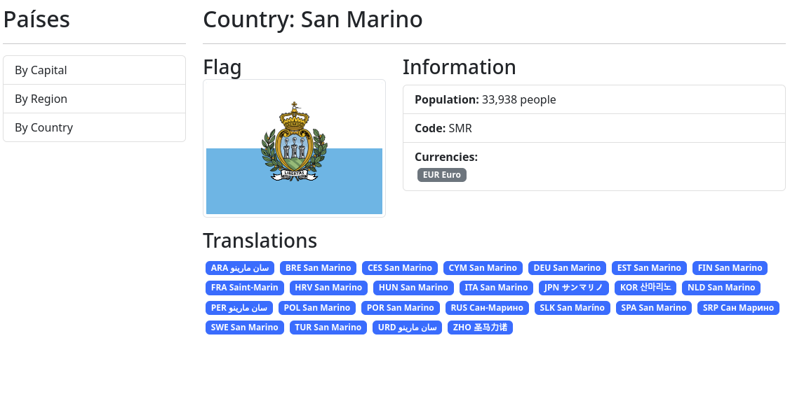


## Navegar desde el CountryTableComponent

Al final de la tabla agreguemos un link:

```html
<td>
    <a [routerLink]="['/countries/by', country.cca3]" class="btn btn-outline-primary btn-sm">
        View
    </a>
</td>
```

Dado que estamos usando el **routerLink** necesitamos importar el **RouterModule** en el módulo al que pertenece el **CountryTableComponent** es decir en el **CountriesModule**:


```typescript

import { RouterModule } from '@angular/router';

@NgModule({
  imports: [
    RouterModule
  ]
})
export class CountriesModule { }
```

Listo, con esto tenemos un link al final de la tabla que abre el componente **CountryPageComponent** con el país seleccionado

<br/>
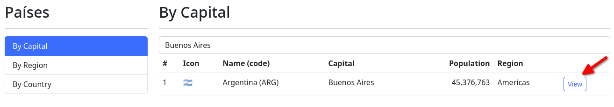

<div style="page-break-after: always;"></div>

### Nueva Sección: Mejoras y Funcionalidades Extras

¿Qué veremos en esta sección?

Aquí continuaremos la aplicación de países, pero enfocados en la parte de las sugerencias, debounce y mantener el estado de las consultas, este es un breve listado de los temas fundamentales:

- ngClass y diferentes formas de manipular clases
- CSS condicionales
- Optimizaciones a peticiones HTTP
- Debounce manual mediante RxJs
- LocalStorage
- Ideas de Store
- Re-utilización de componentes
- Varios operadores de RxJS aplicados


## Nuevo componente Loading

Vamos agregar un componente que muestre un Spinner mientras cargamos un componente, en este caso la tabla de paises.

```
fcruz@fedora 03-countryApp]$ ng g c shared/components/loadingSpinner
CREATE src/app/shared/components/loading-spinner/loading-spinner.component.css (0 bytes)
CREATE src/app/shared/components/loading-spinner/loading-spinner.component.html (30 bytes)
CREATE src/app/shared/components/loading-spinner/loading-spinner.component.spec.ts (658 bytes)
CREATE src/app/shared/components/loading-spinner/loading-spinner.component.ts (234 bytes)
UPDATE src/app/shared/shared.module.ts (1033 bytes)
```

Agregamos en el template:


```html
<div class="spinner-container bg-dark">
    <span>Searching...</span>
    
</div>
```

Los Estilos

```css
.spinner-container {
  align-items: center;
  background-color: black;
  border-radius: 20px;
  bottom: 15px;
  box-shadow: 0px 0px 10px 0px rgba(0, 0, 0, 0.75);
  color: white;
  display: flex;
  padding: 5px 10px;
  position: fixed;
  right: 15px;
}

span {
  margin-left: 10px;
  font-weight: 800;
}
```

El componente: (no hemos agregado nada)

```typescript
@Component({
  selector: 'shared-loading-spinner',
  templateUrl: './loading-spinner.component.html',
  styleUrl: './loading-spinner.component.css'
})
export class LoadingSpinnerComponent {

}
```

Lo declaramos y lo exportamos en el **SharedModule**

Y luego lo implementamos, primero en el **ByCapitalPageComponent** en el template, en cualquier parte, agregamos el componente

```html
<shared-loading-spinner *ngIf="isLoading"></shared-loading-spinner>
```

Tal como se puede ver depende de una propiedad **isLoading** la cual debemos definir en nuestro compoenente **ByCapitalPageComponent**

```typescript
export class ByCapitalPageComponent {

  private countries: Country[] = [];

  public isLoading: boolean = false;

  constructor(private countryService: CountriesService) { }

  public get getCountries(): Country[] {  
    return this.countries;
  }

  public searchByCapital(term: string) {
    this.isLoading = true;
    this.countryService.searchByCapital(term)
      .subscribe(
        (countries) => {
          this.countries = countries;
          this.isLoading = false;
        });
  }
}
```

**isLoading** es _Flase_ y justo cuando iniciamos la petición **searchByCapital** se cambia a _True_ esto hace que se muestre el Spinner, y cuando se completa la carga se regresa a _False_

<br/>
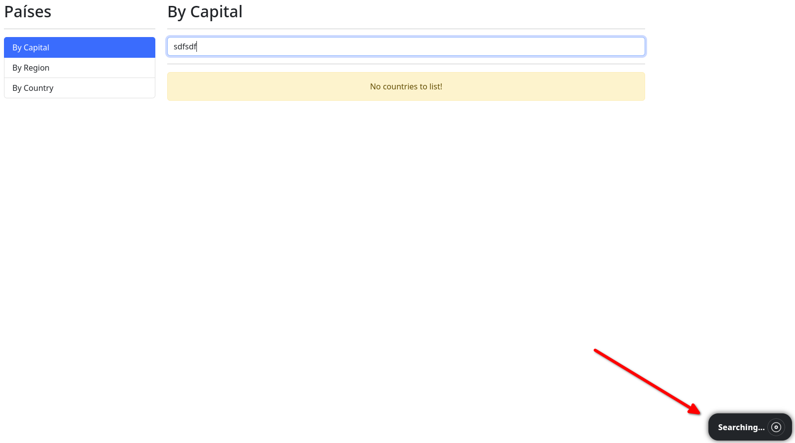

## Debounce

Vamos a escribir esta funcionalidad que permite al usuario realizar la búsqueda sin la necesidad de presionar ENTER, luego de que el usuario deja de escribir por cierto tiempo, vamos a iniciar la búsqueda automáticamente.

Lo primero es agregar un nuevo evento en el textBox del Search, **SearchBoxComponent*


```html
<input 
type="text"
[placeholder]="placeholder"
class="form-control"
(keyup.enter)="searchBy()"
(keyup)="onKeyPress($event)"
#txtSearchInput>
```

Luego debemos implementar el evento **onKeyPress($event)** para ello antes debemos crear un debouncer, y usaremos el **Subject** de rxJS, 

```typescript
/**
 * A Subject is a special type of Observable that allows values to be
 * multicasted to many Observers. Subjects are like EventEmitters.
 *
 * Every Subject is an Observable and an Observer. You can subscribe to a
 * Subject, and you can call next to feed values as well as error and complete.
 */
export class Subject<T> extends Observable<T> implements SubscriptionLike {}
```

Implementamos un debouncer que emitira **strings** (texto de búsqueda del usuario)


```typescript
private debouncer: Subject<string> = new Subject();
```

Luego debemos suscribirnos a ese OBservable, lo hacemos en el **ngOnInit**


```typescript
ngOnInit(): void {
    this.debouncer
    .pipe(
      debounceTime(300)
    )
    .subscribe( value => {
      this.searchBy();
    });
  }
```

Aca vemos que se implementa un **PIPE** para agregar un delay de 300 ms cuando se emite un evento. Luego de ese delay, se dispara el **subscribe** que al final es el que llama a la búsqueda.

Y finalmente, debemos escribir el código que hace la emisión, eso lo hacemos en el método que se llama desde el componente. Es decir desde nuestro **onKeyPress**


```typescript
public onKeyPress(event: any) {
    this.debouncer.next(this.txtSearchInput.nativeElement.value);
  }
```

Entonces, resumiendo:

- El usuario escribe en la caja de texto
- Esto llama al **onKeyPress** quien emite un evento con el **this.debouncer.next**
- El **.pipe(debounceTime(300))** detiene por 300 MS el evento
- Si el usuario continúa escribiendo, se genera un nuevo evento y se cancela el anterior
- Si el usuario deja de escribir durante 300 MS, se ejecuta la suscripción **.subscribe( value => {this.searchBy();});**
- Eso dispara la búsqueda **this.searchBy();**
- El usuario ve datos en pantalla


<br/>
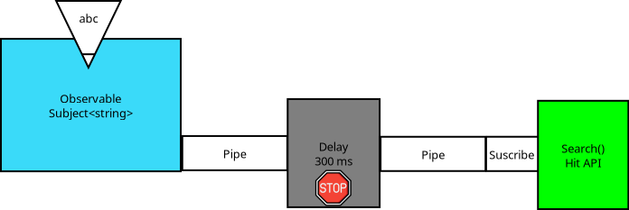


## Limpieza de suscripciones

Generalmente, a nivel de componentes, cuando estos se destruyen, las suscripciones siguen activas, y aunque no se disparen más, (hasta que el componente se cree nuevamente) es mejor limpiarlas. Para ello se implementa el **ngOnDestroy**

```typescript
ngOnDestroy(): void {
    this.debouncer.unsubscribe();
  }
```

## Optimizar búsqueda por regiones

La búsqueda por región solo acepta ciertas regiones, lo mejor es usar un dropdown o algo similar para que el usuario seleccione una región específica en lugar de usar el SearchBox.

Primero en el componente **ByRegionPageComponent** agregamos un tipo y un arreglo de ese tipo

```typescript
type regions = 'africa' | 'americas' | 'asia' | 'europe' | 'oceania';

public regions: regions[] = ['africa', 'americas', 'asia', 'europe', 'oceania'];
```

Luego, en el template del mismo componente, vamos a eliminar la referencia al componente **shared-search-box** y lo reemplazaremos por una lista de botones, uno por cada región.


```html
<button 
        *ngFor="let region of regions"
        [ngClass]="{ 'btn-outline-primary': region === activeRegion }"
        class="btn  btn-block m-2 text-center"
        (click)="searchByRegion(region)"
        >
            {{ region | titlecase }}
</button>
```

Se agrega un [ngClass] para permitir agregar una clase que muestre que botón ha sido seleccionado, el resultado es:

<br/>


## Mantener Data en Pantalla
La versión actual de la app, no permite persistir datos cuando nos movemos entre pantallas, si realizamos una búsqueda y nevegamos al detalle de un país, al regresar hemos perdido el resultado de la búsqueda realizada anteriormente.

Esto sucede porque cuando cambiamos de ruta, el componente presentado se destruye para mostrar uno nuevo. Y varias propiedades, como la lista de países, se inicializan con un arreglo vacío, al inicializar el componente, por lo tanto la tabla de países siempre aparece vacía.

Se puede implementar LocalStorage, para que cada componente guarde la lista de paises, o podemos usar algún tipo de estructura en memoria para guardar los datos.

usaremos un OBjeto en memoria, y el mejor lugar para colocarlo es el servicio, ya que este se inyecta una sola vez y permanece en memoria durante la ejecución de la app.

En primer lugar, el tipo _Regions_ que habíamos agregado a nivel del servicio, lo vamos a crear en un archivo independiente dentro de un directorio _Types_ 

```typescript
export type Regions = 'africa' | 'americas' | 'asia' | 'europe' | 'oceania';
```

Luego vamos a crear una interfaz, dentro del directorio _interfaces_

```typescript
import { Regions } from "../types/regions.types";
import { Country } from "./country.interface";

export interface cacheStorage {
    byCapital: cacheData;
    byCountry: cacheData;
    byRegion : cacheRegionData;
}

export interface cacheData {
    term     : string;
    countries: Country[];
}

export interface cacheRegionData {  
    region?    : Regions;
    countries  : Country[];
}
```

Y luego, en nuestro servicio, creamos la estructura de datos:

```typescript
public cacheCountries: cacheStorage = {
    byCapital: { term: '', countries: [] },
    byCountry: { term: '', countries: [] },
    byRegion : { region: undefined, countries: [] },
  }
```

Notar que para Region hemos definido como nullable, porque no podemos inicializarla con una cadena vacía, porque no es aceptado por nuestro tipo de datos **Regions**

Por lo tanto la inicializamos en _undefined_


 ## Guardando datos en el cacheStorage

 El punto ideal para guardar es en el servicio, tan pronto realizamos la búsqueda debemos de guardar en el cacheStorage.

 Por ejemplo, en la búsqueda por Capital

 ```typescript
 searchByCapital(term: string): Observable<Country[]> {
    const url = `${this.apiUrl}/capital/${term}`;
    return this.searchCountries(term, url);
  }
```

Pero recordemos que el **this.searchCountries(term, url);** retorna un _Observable_, y como necesitamos seguir regresando el mismo tipo de datos no podemos _Suscribirnos_ para acceder a los _Countries_, pero, podemos usar un **PIPE** con una función RXJS para acceder a los Countries, llenar el Cache y retornar siempre un Observable, lo haremos con el **TAP**


 ```typescript
 searchByCapital(term: string): Observable<Country[]> {
    const url = `${this.apiUrl}/capital/${term}`;
    return this.searchCountries(term, url)
    .pipe(
      tap( (countries) => {
        this.cacheCountries.byCapital = { term, countries };
      })
    );
  }
```

El **TAP** unicamente extrae el dato de la tubería, y no es necesario especificar un **return**, el flujo continua siendo un Observable.

A diferencia del **MAP** u otras funciones, estas interceptan el valor, lo procesan y debemos retornar algo a la tubería explicitamente.

Aplicamos el mismo cambio en las otras búsquedas dentro del mismo servicio y listo, ahora falta usar esa información en memoria.

## Usando el cacheStorage
En este caso, debemos implementar esto a nivel de componente, todo aquel componente que use la lista de países, podemos ir al **cacheStorage** y tomar los datos iniciales de allí, en lugar de inicializarlo con un arreglo vacío.

También necesitamos restaurar el último término de búsqueda.

Haremos en cambio en el **ByCapitalPageComponent**, ya tenemos una propiedad para la lista de paises, agreguemos una para el termino de búsqueda:

```typescript
  private countries: Country[] = [];
  public sotoredSearchValue: string = '';
```

En el ngOnInit necesitamos cargar estos valores desde el Caché:

```typescript
ngOnInit(): void {
    this.sotoredSearchValue = this.countryService.cacheCountries.byCapital.term;
    this.countries = this.countryService.cacheCountries.byCapital.countries;
  }
```
Con este cambio, ya estamos listos con el asunto de los países, veremos que la tabla de Países mantiene el último resultado cuando nos movemos entre componentes, pero no así con el término de búsqueda. PAra el caso de la búsqueda por Capital y Pais usamos el **SearchBoxComponent**, debemos pasarle el valor guardado en memoria, y para ello necesitamos agregar un @Input en dicho componente:

```typescript
@Input() public sotoredSearchValue: string = '';
```

y luego lo usamos en su template:

```html
<input 
type="text"
[value]="sotoredSearchValue"
[placeholder]="placeholder"
class="form-control"
(keyup.enter)="searchBy()"
(keyup)="onKeyPress($event)"
#txtSearchInput>
```

Y finalmente necesitamos pasarle ese valor desde el componente que lo implementa, en este caso desde **ByCapitalPageComponent**


```html
<div class="col">
        <shared-search-box
        [sotoredSearchValue]="sotoredSearchValue"
        placeholder="Search by Capital"
        (onNewSearch)="searchByCapital($event)">
        </shared-search-box>
</div>
```

Con ese cambio, podemos mantener tanto el último término de búsqueda como la lista de países cuando nos movemos entre componentes.

La implementación es exactamente igual para el componente **ByCountryPageComponent** pero en el caso de la región debemos usar otra forma para indicar que región había sido seleccionada, porque en ese caso usamos botones en lugar del SearchBOX.


```typescript
ngOnInit(): void {
    this.countries = this.countryService.cacheCountries.byRegion.countries;
    this.activeRegion = this.countryService.cacheCountries.byRegion.region;
  }
```

## Agregando Mapas (No inlcuido en el curso)

Usaremos la libreria **leaflet**

```
npm install leaflet @asymmetrik/ngx-leaflet leaflet-minimap
```

Agregamos un componente básico:

```
[fcruz@fedora 03-countryApp]$ ng g c shared/components/map
CREATE src/app/shared/components/map/map.component.css (0 bytes)
CREATE src/app/shared/components/map/map.component.html (18 bytes)
CREATE src/app/shared/components/map/map.component.spec.ts (580 bytes)
CREATE src/app/shared/components/map/map.component.ts (187 bytes)
UPDATE src/app/shared/shared.module.ts (1146 bytes)

```

Buscamos la sección de Styles en el archivo **angular.json** y agregamos:

```json
"styles": [
    "node_modules/leaflet/dist/leaflet.css",
    "node_modules/leaflet-minimap/dist/Control.MiniMap.css"
    "src/styles.css"
```

Tambien agregamos los JS

```json
"scripts": [
  "node_modules/leaflet/dist/leaflet.js",
  "node_modules/leaflet-minimap/dist/Control.MiniMap.js"
]
```

El componente se define de la siguiente forma, el template es muy simple:

```html
<div class="map-container">
    <div class="map-frame">
      <div id="map"></div>
    </div>
</div>
```

Y el componente en sí contiene el siguiente código:

```typescript
import { AfterViewInit, Component, Input } from '@angular/core';
import * as leaflet from 'leaflet';
import { CountryMap } from '../../../countries/interfaces/country.interface';
import { HttpClient } from '@angular/common/http';

@Component({
  selector: 'shared-map',
  templateUrl: './map.component.html',
  styleUrl: './map.component.css'
})
export class MapComponent  implements AfterViewInit{
  
  @Input() public countries!: CountryMap[];

  private map!: leaflet.Map;

  private initMap(): void {

    if (!this.countries) {
      return;
    }

    var lat = this.countries[0].latlng[0];
    var lng = this.countries[0].latlng[1];

    this.map = leaflet.map('map', {
      center: [ lat, lng ],
      zoom: 5
    });

    const tiles = leaflet.tileLayer('https://{s}.tile.openstreetmap.org/{z}/{x}/{y}.png', {
      maxZoom: 18,
      minZoom: 3,
      attribution: '&copy; <a href="http://www.openstreetmap.org/copyright">OpenStreetMap</a>'
    });

    tiles.addTo(this.map);

    this.loadGeoJson(this.countries[0].cca3);
  }

  constructor(private httpClient: HttpClient) { }

  ngAfterViewInit(): void {
    this.initMap();
  }

  private loadGeoJson(countryCode: string): void {
    const geoJsonUrl = `../../assets/geojsonfiles/${countryCode}.geojson`;

    this.httpClient.get(geoJsonUrl).subscribe((geoJson: any) => {
      const geoJsonLayer = leaflet.geoJSON(geoJson);
      geoJsonLayer.addTo(this.map);
    });
  }
}

```

El componente acepta un arreglo de paises, pero por el momento solo estamos mostrando el primer país

```typescript
var lat = this.countries[0].latlng[0];
var lng = this.countries[0].latlng[1];
```

La idea es que cuando abrimos la información de un país en específico debemos colorear el área de dicho país en el mapa, para ellos necesitmos unos arhivos especiales, los geoJson, el cual contiene toda la inforamción para crear la capa necesaria en el mapa.


Estos archivos fueron descargados del sitio [https://www.geoboundaries.org](https://www.geoboundaries.org) se descargó el archivo global, y mediande un script en PHP se crearon archivos individuales usando el código de país

```php
<?php

ini_set('memory_limit', '8912M');

// Read the geoBoundariesCGAZ_ADM0.geojson file
$geoBoundariesCGAZ_ADM0 = file_get_contents('geoBoundariesCGAZ_ADM0.geojson');
$geoBoundariesCGAZ_ADM0 = json_decode($geoBoundariesCGAZ_ADM0, true);

// Loop through the features
foreach ($geoBoundariesCGAZ_ADM0['features'] as $feature) {
    // Get the country code
    $countryCode = $feature['properties']['shapeGroup'];

    // Create the file name
    $fileName = 'byCountry/' . $countryCode . '.geojson';

    // Create the FeatureCollection structure
    $featureCollection = [
        'type' => 'FeatureCollection',
        'crs' => [
            'type' => 'name',
            'properties' => [
                'name' => 'urn:ogc:def:crs:OGC:1.3:CRS84'
            ]
        ],
        'features' => [$feature] // Contiene solo la característica actual
    ];

    // Convertir la estructura a JSON
    $featureCollectionJson = json_encode($featureCollection, JSON_PRETTY_PRINT);

    // Crear el archivo con la estructura FeatureCollection
    file_put_contents($fileName, $featureCollectionJson);
}


```

Esto genero un archivo por país el cual es leído desde el médoto **loadGeoJson**


```typescript
private loadGeoJson(countryCode: string): void {
    const geoJsonUrl = `../../assets/geojsonfiles/${countryCode}.geojson`;

    this.httpClient.get(geoJsonUrl).subscribe((geoJson: any) => {
      const geoJsonLayer = leaflet.geoJSON(geoJson);
      geoJsonLayer.addTo(this.map);
    });
  }
```

Se agregó una interfaz para enviar datos reducidos al mapa y no todo el objeto de Country:

```typescript
export interface CountryMap {
    name:         string;
    cca2:         string;
    ccn3:         string;
    cca3:         string;
    cioc:         string;
    latlng:       number[];
    maps:         Maps;
}
```

Ese es el tipo de dato que recibe el componente Mapa

``` typescript
@Input() public countries!: CountryMap[];
```

Luego usamos el nuevo componente, lo agregaremos al **CountryPageComponent** primero definimos una propiedad:

```typescript
public countryMap: CountryMap[] = [];
```

Esta propiedad se llena en el ngOnInit

```typescript
this.countryMap = [this.CountryMapMapper(country)];
```

Recordemos que **country** cotiene toda la información que proviene del servicio `this.countriesService.getCountryByAlpha(id)` adicionalmente, mapeamos toda la información del país a un objeto más simple.


```typescript
private CountryMapMapper(country: Country): CountryMap {
    return {
      name: country.name.common,
      cca2: country.cca2,
      ccn3: country.ccn3,
      cca3: country.cca3,
      cioc: country.cioc,
      latlng: country.latlng,
      maps: country.maps,
    }
  }
```

Finalmente agregamos a nuestro template la referencia al mapa y le pasamos un arreglo de países, en este caso un único país, el seleccionado para mostrar


```html
<div class="map-component-container">
  <shared-map [countries]="countryMap"></shared-map>
</div>
```

Los resultados:

<br/>
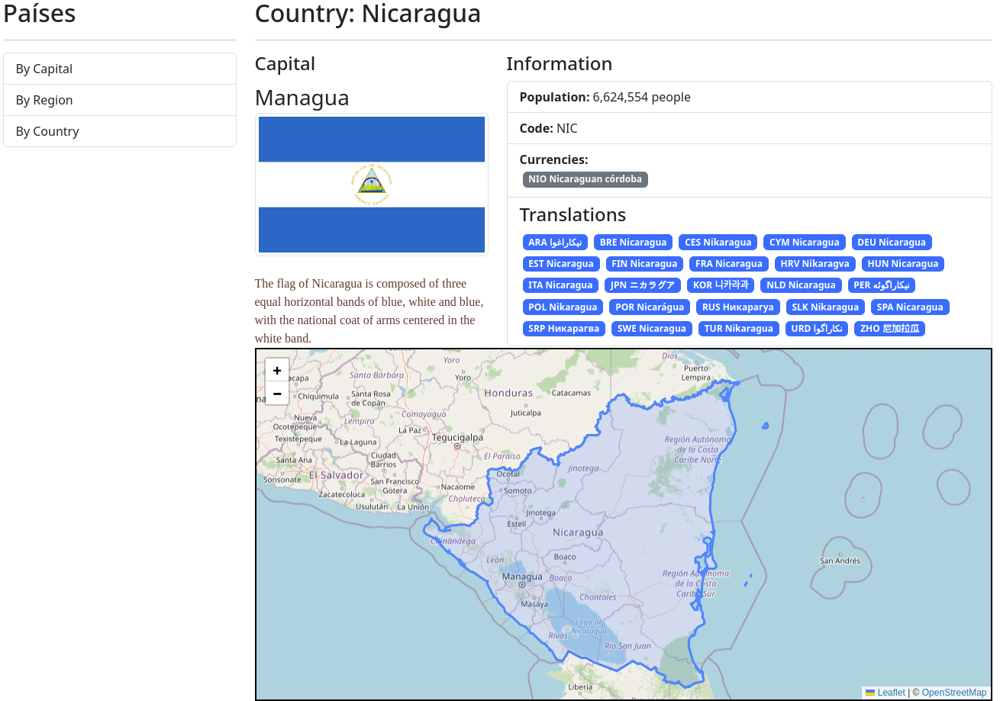

<div style="page-break-after: always;"></div>

### Nueva Sección: PIPES en Angular

¿Qué veremos en esta sección?

Esta sección es de mis favoritas del curso, veremos temas sobre Pipes y transformación visual de la data, pero también decidí mezclarlo con otro tema muy solicitado que es PrimeNG (Más adelante hay también una sección con muchos componentes de Angular Material), pero esta sección pretende enseñarles muchas cosas interesantes, aparte de los Pipes de Angular

Este es un breve listado de los temas fundamentales:

Todos los Pipes de Angular a la fecha

 **Uppercase, Lowercase, TitleCase, Date, Decimal, Currency, Percent,i18nSelect, i18Plural,KeyValue, Json, Async,PrimeNG.**

Módulo especializado para módulos de PrimeNG

PrimeNG es un paquete de componentes estilizados que contienen funcionalidades basadas en Angular para crear aplicaciones elegantes, hermosas y funcionales rápidamente.

## Nueva APP
Crearemos una nueva APP para implementar los PIPES

```
ng new 04-pipesApp --standalone false
```

Borrar el template del HTML y dejar el 

```html
<router-outlet></router-outlet>
```

## Que son los Pipes?

Los **pipes** (tuberías o filtros) son herramientas que te permiten transformar y dar formato a los datos que se muestran en la interfaz de usuario. Los pipes se utilizan principalmente en las plantillas de Angular para realizar operaciones de manipulación y presentación de datos de manera declarativa.

Angular proporciona varios pipes incorporados que cubren tareas comunes, como formatear fechas, números, cadenas de texto, entre otras. Algunos ejemplos de pipes integrados en Angular incluyen DatePipe, DecimalPipe, y UpperCasePipe.

Aquí hay un ejemplo básico de cómo se utiliza un pipe en una plantilla de Angular:

```html
<!-- Supongamos que 'nombre' es una variable en el componente -->
<p>{{ nombre | uppercase }}</p>
```

En este ejemplo, **uppercase** es un pipe que convierte el valor de la variable nombre a mayúsculas antes de mostrarlo en la plantilla.

Además de los pipes integrados, también puedes crear tus propios **pipes personalizados** para realizar transformaciones específicas de datos según tus necesidades. Los pipes personalizados te permiten encapsular lógica de formato y reutilizarla en diferentes partes de tu aplicación.

Aquí hay un ejemplo simple de cómo crear un pipe personalizado en Angular:

```typescript
import { Pipe, PipeTransform } from '@angular/core';

@Pipe({
  name: 'miPipePersonalizado'
})
export class MiPipePersonalizado implements PipeTransform {
  transform(valor: any): any {
    // Realizar la lógica de transformación aquí
    // Devolver el valor transformado
    return valor;
  }
}
```

Luego, en tu plantilla, puedes usar el pipe personalizado de la siguiente manera:


```html
<p>{{ miDato | miPipePersonalizado }}</p>
```

## PrimeNG

PrimeNG es una biblioteca de componentes de interfaz de usuario (UI) para Angular. Proporciona una amplia variedad de componentes UI que pueden ser utilizados en el desarrollo de aplicaciones web con Angular. 

Instalación:

```
npm install primeng primeicons --save
```

También vamos a requerir instalar el Angular Animations, algunos controles, como el Menu requieren estas animaciones. 
```
npm install @angular/animations --save
```
Agregamos al **Angular.json** los siguientes estilos

```json
"styles": [
    "src/styles.css",
    "node_modules/primeng/resources/themes/lara-light-indigo/theme.css",
    "node_modules/primeng/resources/primeng.min.css",
    "node_modules/primeicons/primeicons.css"
],
```

**NOTA**: Podemos cambiar el theme, en lugar de lara-light-indigo podemos ubicar otro theme en el directorio y aplicarlo.

**NOTA** También podemos incluir los archivos en Assets para cambiarlos de forma dinámica. En el caso de agregarlos al **angular.json** debemos construir la APP.


Probaremos un botón, en el **app.module.ts**

```typescript
import { ButtonModule }  from 'primeng/button';
```

y lo colocamos en la seccón **imports:** del mismo archivo, luego en el template:

```html
<p-button label="Submit"></p-button>
```

También podemos usar algunos iconos

```html
<p-button icon="pi pi-check"></p-button>
<p-button label="Submit" icon="pi pi-check"></p-button>
<p-button label="Submit" icon="pi pi-check" iconPos="right"></p-button>
```

Conultar el sitio [https://primeng.org/button](https://primeng.org/button) para obtener más información sobre como implementar los botones.

## Módulo personalizado primeNg

Dado que estaremos importando muchos módulos de PrimeNg, una idea es crear un módulo personalizado y agregar los imports de primeNg en un solo lugar, esto es una idea, pueden existir otras implementaciones:

```
[fcruz@fedora 04-pipesApp]$ ng g m primeNg
CREATE src/app/prime-ng/prime-ng.module.ts (193 bytes)
```

El inconveniente es que centralizamos la carga de todos los módulos en un solo archivo, y los más seguro es que muchos componentes usaran unos cuantos módulos nada mas. 


## Agregando Menu
Antes crearemos la estructura básica de nuestra APP, por el momento agregamos el módulo Shared, 
```
ng g m shared/shared
CREATE src/app/shared/shared.module.ts (192 bytes)
```

Verificamo que el sharedModule este importado en el App.module.ts

Luego, dentro de la carpeta shared creamos la carpeta **components** y agregamos el componente Menu

```
[fcruz@fedora 04-pipesApp]$ ng g c shared/components/menu
CREATE src/app/shared/components/menu/menu.component.css (0 bytes)
CREATE src/app/shared/components/menu/menu.component.html (19 bytes)
CREATE src/app/shared/components/menu/menu.component.spec.ts (587 bytes)
CREATE src/app/shared/components/menu/menu.component.ts (191 bytes)

```

Dado que usaremos el menú, importamos el **SharedModule** en el **app.module.ts**

Vamos ahora al template del menu:

```html
<p-menu [model]="items"></p-menu>
```

En el código del Menu Component agregamos:

```typescript
import { Component, OnInit } from '@angular/core';
import { MenuItem } from 'primeng/api';

@Component({
  selector: 'shared-menu',
  templateUrl: './menu.component.html',
  styleUrl: './menu.component.css'
})
export class MenuComponent implements OnInit{
  
  public items: MenuItem[] = [];

  ngOnInit(): void {
    this.items = [
      {label: 'Home', icon: 'pi pi-fw pi-home'},
      {label: 'Products', icon: 'pi pi-fw pi-shopping-cart'},
      {label: 'About', icon: 'pi pi-fw pi-info-circle'},
    ]
  }
}
```

Esto mostrará la página en blanco con un error:

```
RROR Error: NG05105: Unexpected synthetic listener @overlayAnimation.start found. Please make sure that:
  - Either `BrowserAnimationsModule` or `NoopAnimationsModule` are imported in your application.
```

Básicamente el componente de Menu de PrimeNg requiere un módulo de animación, ya sea el BrowserAnimationsModule o el NoopAnimationsModule. Al inicio de la sección hemos instalado el **BrowserAnimationsModule** de **@Angular** así que vamos a usarlo, primero debemos importarlo en el **app.module.ts** y luego lo agregamos a la sección **imports** del mismo arhivo:


```typescript
import { BrowserAnimationsModule } from '@angular/platform-browser/animations';

@NgModule({
  imports: [
    BrowserAnimationsModule,
  ]
})
export class AppModule { }
```

Con este cambio, el error desaparece y el menú se muestra en la pantalla:

<br/>
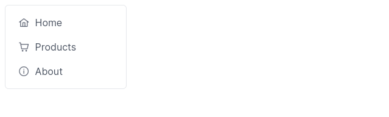

Dado que ocupamos un menu horizontal, en el header de la aPP, vamos a cambiar el **menu** por el **menubar**

1. En el **PrimeNgModule** importamos el menubar, y lo agregamos al **Exports[]**

```typescript
import { MenubarModule } from 'primeng/menubar';

@NgModule({
  declarations: [],
  imports: [],
  exports: [
    MenubarModule,
  ]
})
export class PrimeNgModule { }
```

2. En nuestro **MenuComponent** creamos un menú con más opciones:

```typescript
this.items = [
      {
        label: 'Pipes de Angular', 
        icon: 'pi pi-desktop',
        items: [
          {
            label: 'Textos y Fechas',
            icon: 'pi pi-align-left',
            routerLink: '/'
          },
          {
            label: 'Numeros',
            icon: 'pi pi-dollar',
            routerLink: 'numeros'
          },
          {
            label: 'No comunes',
            icon: 'pi pi-globe',
            routerLink: 'no-comunes'
          }
        ]
      },{
        label: 'Pipes personalizados', 
        icon: 'pi pi-cog',
        routerLink: 'ordenar'
      }
     
    ]
  }
```

3. Cambiamos el template

```html
<p-menubar [model]="items">
    
</p-menubar>
```

Verificamos el resultado:

<br/>
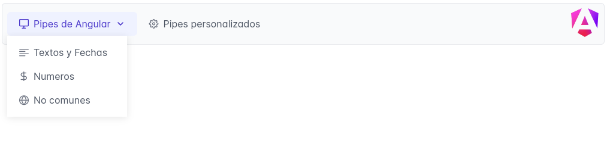


## Módulos y Rutas de la Applicación

Crearemos un módulo para relizar la carga perezosa, 

```
[fcruz@fedora 04-pipesApp]$ ng g m products --routing
CREATE src/app/products/products-routing.module.ts (251 bytes)
CREATE src/app/products/products.module.ts (288 bytes)
```

**--routing** En Angular, un "routing module" es un módulo especializado que se utiliza para gestionar la navegación y la configuración de las rutas en una aplicación. Este módulo se encarga de definir las rutas y las asociaciones entre las URL y los componentes que se deben cargar cuando el usuario navega a una determinada URL.

Dentro del directorio **products** crearemos el directorio **pages** y dentro del mismo agregaremos nuestros componentes

```
ng g c products/pages/basicsPage --skip-tests
ng g c products/pages/numbersPage --skip-tests
ng g c products/pages/uncommonPage --skip-tests
```

Resultado

```
[fcruz@fedora 04-pipesApp]$ tree src/app/products/pages/
src/app/products/pages/
├── basics-page
│   ├── basics-page.component.css
│   ├── basics-page.component.html
│   └── basics-page.component.ts
├── numbers-page
│   ├── numbers-page.component.css
│   ├── numbers-page.component.html
│   └── numbers-page.component.ts
└── uncommon-page
    ├── uncommon-page.component.css
    ├── uncommon-page.component.html
    └── uncommon-page.component.ts
```

Ya hemos creado el routingModule de nuestra página de productos, hemos agregado los componentes tipo Page, y ahora necesitamos agregar las rutas para navegar a dichas páginas.

En el **ProductsRoutingModule** (nuestro routing module para productos) agregamos las rutas:

```typescript
const routes: Routes = [
  {
    path: '',
    component: BasicsPageComponent
  },
  {
    path: 'numbers',
    component: NumbersPageComponent
  },
  {
    path: 'uncommon',
    component: UncommonPageComponent
  },
  {
    path: '**',
    redirectTo: ''
  }
];
```

Recordemos que estas son rutas hijas, debemos agregarlas en el mismo **ProductsRoutingModule** como **Childs**


```typescript
@NgModule({
  imports: [RouterModule.forChild(routes)],
  exports: [RouterModule]
})
export class ProductsRoutingModule { }
```

Ahora vamos a nuestro Router principal, **AppRoutingModule** y hacemos la carga perezosa de nuestro products Module


```typescript
const routes: Routes = [
  {
    path: '',
    loadChildren: ()=> import('./products/products.module').then(m => m.ProductsModule)
  }
];

@NgModule({
  imports: [RouterModule.forRoot(routes)],
  exports: [RouterModule]
})
export class AppRoutingModule { }
```

Reordemos esta sintáxis:

```typescript
loadChildren: ()=> import('./products/products.module').then(m => m.ProductsModule)
```


**loadChildren**: Es una propiedad de configuración de ruta en Angular. Se utiliza para cargar dinámicamente un módulo cuando se navega a una ruta específica.

**() => import('./products/products.module'):** Aquí se utiliza una función de flecha para definir un punto de entrada dinámico al módulo que se va a cargar. La función import() es una característica de JavaScript llamada "import dinámico". Este enfoque permite cargar módulos de manera asíncrona, lo que es fundamental para la carga perezosa.
        
**import('./products/products.module')**: Esta parte del código indica que el módulo products.module se cargará de manera dinámica. El camino relativo ('./products/products.module') indica la ubicación del archivo del módulo.

**.then(m => m.ProductsModule):** Después de que el módulo es importado dinámicamente, la función then() se utiliza para especificar lo que debe suceder después de que la importación sea exitosa. En este caso, m representa el módulo importado, y m.ProductsModule es la referencia al módulo de productos que será cargado de forma perezosa.


## Conectando el MenuBar con las Rutas.

Para Links internos, usamos el **routerLink** del **MenuItem** para enlazar a una ruta interna. Si fuese externa podemos usar el **URL**

```typescript
this.items = [
      {
        label: 'Pipes de Angular', 
        icon: 'pi pi-desktop',
        items: [
          {
            label: 'Textos y Fechas',
            icon: 'pi pi-align-left',
            routerLink: '/'
          },
          {
            label: 'Numeros',
            icon: 'pi pi-dollar',
            routerLink: 'numbers'
          },
          {
            label: 'No comunes',
            icon: 'pi pi-globe',
            routerLink: 'uncommon'
          }
        ]
      },{
        label: 'Pipes personalizados', 
        icon: 'pi pi-cog',
        routerLink: 'ordenar'
      }
     
    ]
```

## Construir Basics Page 

Vamos a agregar primeramente una serie de Imports en el **PrimeNgModule** los cuales los usaremos en varios de los componentes que estamos por desarrollar.

```typescript
import { ButtonModule } from 'primeng/button';
import { CardModule } from 'primeng/card';
import { FieldsetModule } from 'primeng/fieldset';
import { MenubarModule } from 'primeng/menubar';
import { PanelModule } from 'primeng/panel';


@NgModule({
  declarations: [],
  imports: [],
  exports: [
    ButtonModule,
    CardModule,
    FieldsetModule,
    MenubarModule,
    PanelModule
    
  ]
})
export class PrimeNgModule { }
```

Si queremos agregar algún Module de PrimeNG recien importado, dentro de cualquire página o componente del nuevo módulo **Products** debemos importarlo en dicho módulo, recordemos que cada módulo requeire importar lo que necesita usar.

Entonces agregamos en nuestro **ProductsModule** en la sección de imports el **PrimeNgModule**

Y luego iniciemos con la construcción del Compomente, agregemos una propiedad pública en el código del compomente **BasicsPageComponent**

```typescript
export class BasicsPageComponent {

  public name: string = 'fReddY cRuz'
}
```

Y agregemos esto en el template:

```html
<p-panel [toggleable]="true">
    <p-header>
        <h2>Basics Angular Pipes</h2>
    </p-header>
   
    <p>
        Basics Angular Pipes, included in CommonModule.
    </p>
    <p>
        Consider having the following public property in your component:
    </p>
    <pre>
        <code style="white-space: nowrap;">
            <span style="color: blue;">public</span>
            <span style="color: #333;"> name</span>
            <span style="color: #333;">: string = </span>
            <span style="color: green;">'fReddY cRuz'</span>
          </code>
    </pre>
    
    <div class="grid">
        <div class="col-12 md:col-4">
            <p-card header="Uppercase">
                <pre class="wrapper">{{ "{{ name | uppercase }}" }} produces {{ name | uppercase }}</pre> 
            </p-card>
        </div>
        <div class="col-12 md:col-4">
            <p-card header="Lowecase">
                <pre class="wrapper">{{ "{{ name | lowercase }}" }} produces {{ name | lowercase }}</pre>
            </p-card>
        </div>
        <div class="col-12 md:col-4">
            <p-card header="TitleCase">
                <pre class="wrapper">{{ "{{ name | titlecase }}" }} produces {{ name | titlecase }}</pre>
            </p-card>
        </div>
    </div>
</p-panel>


```


## PrimeFlex

**PrimeFlex** es una biblioteca de utilidades CSS que presenta varios helpers, como un sistema de cuadrícula, flexbox, espaciado, elevación y más. Las clases que agregamos al template anterior no tienen efecto aún, necesitamos instalar el PrimeFlex

```
npm install primeflex --save
```

Y luego agregamos el estilo en el **Angular.json**

```json
"styles": [
  "src/styles.css",
  "node_modules/primeng/resources/themes/lara-light-indigo/theme.css",
  "node_modules/primeng/resources/primeng.min.css",
  "node_modules/primeicons/primeicons.css",
  "node_modules/primeflex/primeflex.css"
],
```

Con eso cambios se genera esta vista:

<br/>
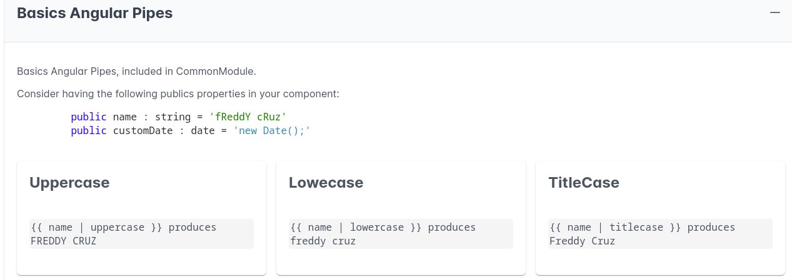


Agregar este otro Card

```html
<div class="col-12 md:col-6">
  <p-card header="Date">
    <pre class="wrapper">{{ "{{ customDate | date }}" }} produces {{ customDate | date }}</pre>
    <pre class="wrapper">{{ "{{ customDate | date:'short' }}" }} produces {{ customDate | date: 'short' }}</pre>
    <pre class="wrapper">{{ "{{ customDate | date:'medium' }}" }} produces {{ customDate | date: 'medium' }}</pre>
    <pre class="wrapper">{{ "{{ customDate | date:'long' }}" }} produces {{ customDate | date: 'long' }}</pre>
    <pre class="wrapper">{{ "{{ customDate | date:'full' }}" }} produces {{ customDate | date: 'full' }}</pre>
    <pre class="wrapper">{{ "{{ customDate | date:'shortDate' }}" }} produces {{ customDate | date: 'shortDate' }}</pre>
    <pre class="wrapper">{{ "{{ customDate | date:'mediumDate' }}" }} produces {{ customDate | date: 'mediumDate' }}</pre>
    <pre class="wrapper">{{ "{{ customDate | date:'shortTime' }}" }} produces {{ customDate | date: 'shortTime' }}</pre>
  </p-card>
</div>
```

Produce esta salida:

<br/>
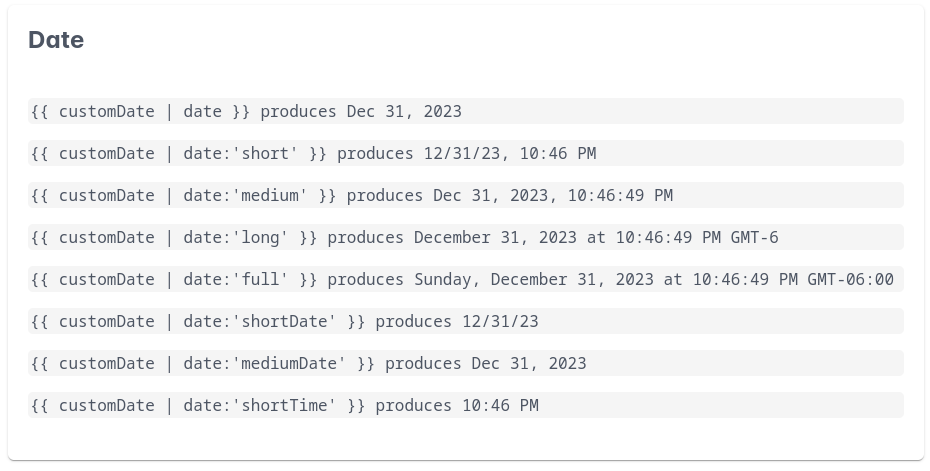

## Configuración del Locale

Para usar el PIPE Date con Locale, es necesario agregar un par de configuraciones, necesitamos importar el Locale que nuestra app va a usar y luego usar la función **registerLocaleData** para registrarlo.

```typescript
import localEsNI from '@angular/common/locales/es-NI';
import { registerLocaleData } from '@angular/common';

registerLocaleData(localEsNI);

@NgModule({})
```

Ahora ya podemos usar el Locale ES-Ni en nuestra app.


```
{{ customDate | date: 'full':'':'es-NI' }} produces lunes, 1 de enero de 2024, 17:04:54 GMT-06:00
```

## Definir globalmente el Locale

Podemos definir un Locale de forma global, para evitar tener que definirlo en cada lugar, por defecto está configurado el en-US, si queremos cambiarlo por otro, debemos cambiar nuestro app.module.ts, 

Debemos mantener los cambios anteriores, es decir importar el Locales y registrarlo, pero para hacerlo que sea el default, debemos agregar un **providers** en el mismo app.module.ts


```typescript
providers: [
    { provide: LOCALE_ID, useValue: 'es-NI' }
  ],
```

Ahora podemos ver las fechas con el locale es-NI.

<br/>
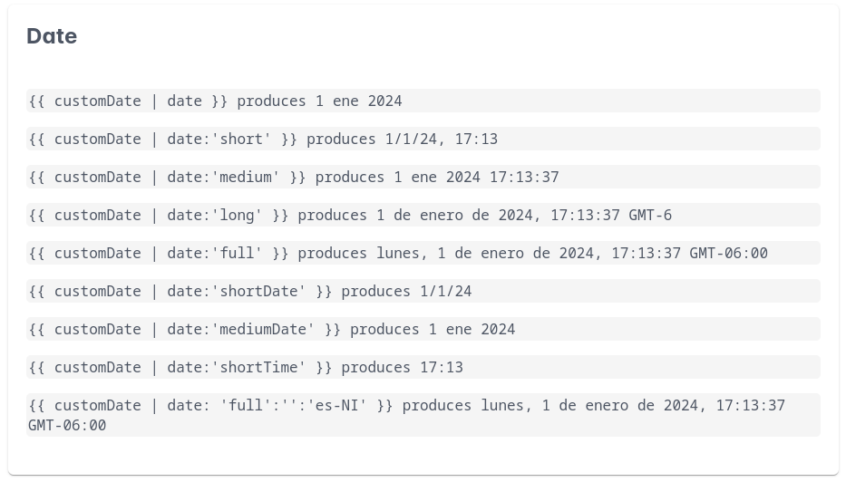

NOTA: El LOCALE_ID se importa del **@angular/core**

```typescript
import { LOCALE_ID, NgModule } from '@angular/core';
```

## Pipes para Números

Creamos un nuevo componente para mostrar la funcionalidad de los Pipes de Números. (Son los mismos pasos y el mismo template, varían únicamente los Pipes a mostrar.)


En el caso de Number, si tenemos esta variable:

```typescript
public amount: number = 123456.789;
```

Y aplicamos el pipe `number: '1.0-2'` obtendremos el valor `123,456.79`

El DecimalPipe se define de esta forma

```      
{{ value_expression | number [ : digitsInfo [ : locale ] ] }}
```

**digitsInfo** se define como:

```
{minIntegerDigits}.{minFractionDigits}-{maxFractionDigits}
```

**minIntegerDigits**: el número mínimo de dígitos enteros antes del punto decimal. El valor predeterminado es 1.

**minFractionDigits**: el número mínimo de dígitos después del punto decimal. El valor predeterminado es 0.

**maxFractionDigits**: el número máximo de dígitos después del punto decimal. El valor predeterminado es 3.


De modo que `'1.0-2'` va a generar un número con:
- Al menos un dígito antes del punto decimal
- Un mínimo de 0 decimales
- Un máximo de 2 decimales

Dado que el número original contiene 3 decimales `123456.789` el valor transformado será `123,456.79`


## Pipes de Moneda

Consultar la documentación oficial para obtener más información sobre los parámetros de monedas. Estos son un par de ejemplos:

```
{{ amount | currency: 'NIO' }} produces C$123,456.79
{{ amount | currency: 'EUR': 'symbol-narrow' | currency }} produces €123,456.79
{{ amount | currency: 'USD': 'symbol-narrow': '1.4-4' }} produces $123,456.7890
```

NOTA: la configuración `1.4-4` indica, al menos 4 decimales (puede agregar ceros) y máximo 4 decimales (puede aplicar redondeos)

## Pipe de Porcentaje

Definida la siguiente propiedad:

```typescript
public percent: number = 0.712;
```

Estos son un par de ejemplos:

```
{{ percent | percent }} produces 71 %
{{ percent | percent: '1.0-2' }} produces 71.2 %
{{ percent | percent: '1.4-4' }} produces 71.2000 %
```


## Uncommon Pipes

Iniciemos con el **i18nSelect**: Selector genérico que muestra la cadena que coincide con el valor actual. Por ejemplo, si vamos a enviar correos de invitación a personas, podemos cambiar algunos textos dependiendo del género.

Creamos este componente:

```typescript
import { Component, OnInit } from '@angular/core';

type gender = 'male' | 'female';
export
interface Client {
  name: string;
  gender: gender;
}

@Component({
  selector: 'app-uncommon-page',
  templateUrl: './uncommon-page.component.html',
  styleUrl: './uncommon-page.component.css'
})
export class UncommonPageComponent {

  //i18nSelect
  public clients: Client[] = [
    { name: 'Freddy', gender: 'male'},
    { name: 'Adrea', gender: 'female'},
    { name: 'Martin', gender: 'male'},
    { name: 'Ana', gender: 'female'}
  ];

  public selectedClient: Client = this.clients[0];

  public changeClient(): void {
    this.selectedClient = this.clients[Math.floor(Math.random() * this.clients.length)];
  }
}
```

En resumen un arreglo de Clientes (nombre y género), un método que cambia aleatoriamente el cliente seleccionado. 


Ahora veamos el Template:

```html
<p-fieldset legend="i18nSelect Pipe" [toggleable]="true">
    <p>
      Saludos {{selectedClient.name}} es un placer invitarlo
      a nuestro evento anual de programadores.
    </p>

    <p-button (onClick)="changeClient()" label="Change Client">
    </p-button>
</p-fieldset>
```

Veamos algunas salidas:

<br/>
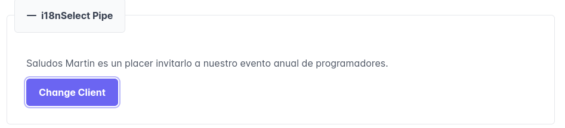

<br/>
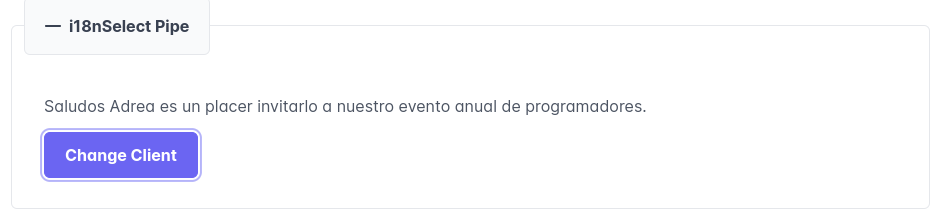


Como podemos ver, en la segunda imagen, el nombre "Andrea" no se corresponde con "Invitarlo", podríamos agregar un **ngIf** que valide el género e imprima **Invitarla** pero para eso tenemos el pipe **i18nSelect**


Agreguemos un MAP, el **invitationMap* que tiene el género como Key, y la palabra a cambiar como el Value.

```typescript
public invitationMap = {
    male: 'invitarlo',
    female: 'invitarla'
  };
```

y cambiemos nuestro template por:

```html
<p>
  Saludos {{selectedClient.name}} es un placer 
  {{ selectedClient.gender | i18nSelect: invitationMap }}
  a nuestro evento anual de programadores.
</p>
```

El resultado: 
P
<br/>


## i18nPlural Pipe

Creamos el siguiente template, 

```html
<p-fieldset legend="i18nPlural Pipe" [toggleable]="true">
  <p>
    Actualmente tenemos {{clients.length}} clientes esperando. 
  </p>
  <p-button
    (onClick)="deleteClient()"
    label="Delete Client">
  </p-button>
</p-fieldset>
```

El método **deleteClient()** simplemente elimina un cliente de la lista, si ejecutamos varias veces el eliminar hasta dejar un solo cliente en el arreglo, se leerá:

```
Actualmente tenemos 1 clientes esperando.
```

Al igual que el **i18nSelect**, podemos proporcionar un Mapa y usar el pipe **i18nPlural**

Creamos el mapa:

```typescript
public totalClientsMap = {
    '=0': 'no tenemos ningún cliente esperando.',
    '=1': 'tenemos un cliente esperando.',
    'other': 'tenemos # clientes esperando.'
  };
```

Cambiamos nuestro Template a esto:

```html
<p>
  Actualmente {{clients.length | i18nPlural: totalClientsMap}}
</p>
```

Esto genera las siguientes salidas:

```
Actualmente tenemos 4 clientes esperando.
Actualmente tenemos 3 clientes esperando.
Actualmente tenemos 2 clientes esperando.
Actualmente tenemos un cliente esperando.
Actualmente no tenemos ningún cliente esperando.
```

## Slice Pipe

El **SlicePipe** Crea un nuevo Array o cadena que contiene un subconjunto (porción) de los elementos.

Creamos este métdo, crea un arreglo con los nombres de los clientes:

```typescript
public clientNames(): string[] {
    return this.clients.map(client => client.name);
  }
```


El siguiente Template:

```html
<p-fieldset legend="Slice Pipe" [toggleable]="true">
  <b>Originals</b>
  <pre> {{ clientNames() }}</pre>
    <b>Slice:0:1</b>
    <pre> {{ clientNames() | slice:0:1 }}<
    <b>Slice:1:1</b>
    <pre> {{ clientNames() | slice:1:2 }}<
    <b>Slice:2:3</b>
    <pre> {{ clientNames() | slice:2:3 }}<
    <b>Slice:3</b>
    <pre> {{ clientNames() | slice:3 }}</pre>
</p-fieldset>
```

Genera:

```
Originals
 Freddy,Adrea,Martin,Ana
Slice:0:1
 Freddy
Slice:1:1
 Adrea
Slice:2:3
 Martin
Slice:3
 Ana
 ```
## Json Pipe

El siguiente template:

```html
<p-fieldset legend="Json Pipe" [toggleable]="true">
    <pre> {{ clients | json }}</pre>
</p-fieldset> 
```

Genera el contenido del arreglo de objetos Clients en formato JSON:

```json
 [
  {
    "name": "Freddy",
    "gender": "male"
  },
  {
    "name": "Adrea",
    "gender": "female"
  },
  {
    "name": "Martin",
    "gender": "male"
  },
  {
    "name": "Ana",
    "gender": "female"
  }
]
```

 ## Key-Value Pipe

El keyValue permite transformar un Objeto tipo Mapa, Key - Value, en interable. Por ejemplo

```typescript
<p-fieldset legend="KeyValue Pipe" [toggleable]="true">
    <ul *ngFor="let client of clients[0] | keyvalue">
        <li>
            {{client | json }}
        </li>
    </ul>
</p-fieldset> 
```
Dato que **clients[0]** retorna un objeto de tipo client

```typescript
interface Client {
  name: string;
  gender: gender;
}
```

Este no es iterable, si omitimos el **keyvalue** obtenemos un error:

```
Type 'Client' is not assignable to type 'NgIterable<any>
```

En resumen, **keyvalue** transforma Objeto o Mapa en un arreglo de pares Key-Value.

La salida del Template es:

```html
{ "key": "gender", "value": "male" }
{ "key": "name", "value": "Freddy" }
```

## Async Pipe

DEfinamos un Observable en el componente

```typescript
public myObservableTimer = interval(1000);
```

Cada 1 segundo, emitirá un evento. 

Si colocamos esto en el Template:

```html
<p-fieldset legend="Async Pipe" [toggleable]="true">
    <pre>{{ myObservableTimer }}</pre>
</p-fieldset>  
```

No se emite ningún resultado, esto se debe a que no nos hemos suscrito al observable, si agregamos el pipe async

```typescript
<pre>{{ myObservableTimer | async }}</pre>
```

Observaremos que cada 1 segundo se imprimer un valor,  0,1,2,... esto se debe a que **async** automáticamente se suscribe al OBservable y recibe los eventos. 

Además, si navegamos a otra página, y si colocamos un console.log con el valor emitido por el observable, veremos que la app deja de recibir los eventos, esto signidica que **async** no solamente se suscribe, sino, que también elimia la suscripcón una vez se destruye el componente.

